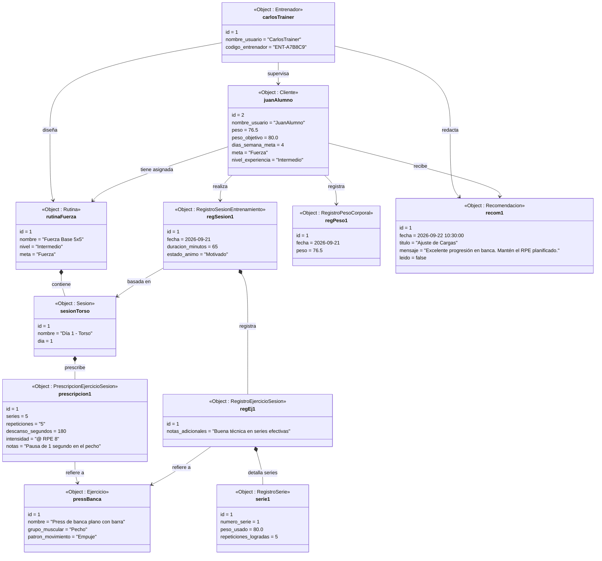
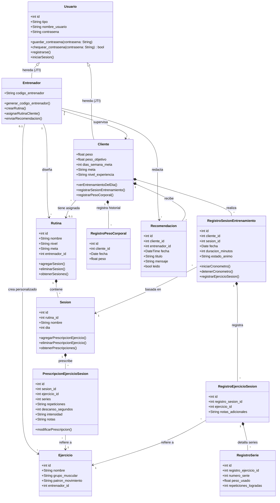

**Universidad del Zulia**  
**Facultad de Ciencias**  
**Licenciatura en Computación**  
**Ingeniería de Software / Auditoría de Sistemas**  

**Diagrama de Objetos y Diagrama de Clases**  
**Sistema de Gestión de Rutinas de Entrenamiento con Pesas**  

Jose Andres Maestre Horcadela C.I.: 30.934.412  
Daniel Isaac Niño Mayorga C.I.: 30.747.937  
Jose David Palmar Sabril C.I.: 31.727.421  

---

1. ### Diagrama de Objetos

El siguiente diagrama ilustra una instancia concreta del sistema en tiempo de ejecución, reflejando el flujo de trabajo implementado en la rama `main` (un entrenador supervisando a un cliente, con rutina asignada, ejecución de sesiones con series descompuestas, historial antropométrico de peso objetivo y recomendaciones asistidas por IA):



---

2. ### Diagrama de Clases

El diagrama de clases representa la arquitectura orientada a objetos y el esquema relacional implementado en `main`, incluyendo la herencia polimórfica (Joined Table Inheritance - JTI), las entidades de prescripción y ejecución detallada, el seguimiento de parámetros meta antropométricos y el módulo de recomendaciones.



---

3. ### Código UML Diagrama de Clases y Especificación de Cambios

#### Principales actualizaciones respecto a la versión inicial:
1. **Herencia de Usuarios (Joined Table Inheritance - JTI)**:
   - Se introdujo la clase base `Usuario` (`id`, `tipo`, `nombre_usuario`, `contraseña`, `guardar_contraseña()`, `chequear_contraseña()`), unificando la autenticación (Flask-Login / UserMixin).
   - `Entrenador` y `Cliente` heredan directamente de `Usuario`.
2. **Atributos de Meta y Frecuencia Semanal en `Cliente`**:
   - `peso_objetivo` (Float, parámetro meta cuantitativo para evaluar progreso físico).
   - `dias_semana_meta` (Integer, meta semanal de adherencia a entrenamientos).
3. **Catálogo y Clasificación de Ejercicios (`Ejercicio`)**:
   - Incorporación del atributo `patron_movimiento` ("Empuje", "Tracción", "Sentadilla", "Bisagra de Cadera", "Aislamiento / Core") para la lógica de fuerza y balance muscular.
   - Atributo `entrenador_id` opcional para permitir ejercicios canónicos globales (`None`) o personalizados por cada entrenador.
4. **Prescripción Adaptada (`PrescripcionEjercicioSesion`)**:
   - Campos escalares normalizados: `series` (int), `repeticiones` (string, ej. "8-10" o "5"), `descanso_segundos` (int), `intensidad` (string opcional, ej. "@ RPE 8") y `notas` (string opcional).
5. **Normalización del Registro de Series (`RegistroSerie`)**:
   - Se desacopló la lista de repeticiones y cargas de `RegistroEjercicioSesion` en una entidad normalizada `RegistroSerie` (`numero_serie`, `peso_usado`, `repeticiones_logradas`).
6. **Historial de Peso Corporal (`RegistroPesoCorporal`)**:
   - Nueva clase que almacena las mediciones periódicas (`fecha`, `peso`) para graficar y auditar la consecución del parámetro meta.
7. **Módulo de Recomendaciones (`Recomendacion`)**:
   - Nueva clase para almacenar las observaciones y sugerencias generadas por el entrenador (asistido por IA Gemini) hacia el cliente (`fecha`, `titulo`, `mensaje`, `leido`).

---

4. ### Codigo Python

A continuación se presenta la implementación correspondiente de las clases del modelo de datos y dominio (`app/models.py`), utilizando SQLAlchemy 2.0 con tipado estático `Mapped` y relaciones bidireccionales:

```python
from typing import Optional, List
import sqlalchemy as sa
import sqlalchemy.orm as so
from app import db, login
from werkzeug.security import generate_password_hash, check_password_hash
from flask_login import UserMixin
import secrets
import string
from datetime import date, datetime

class Usuario(UserMixin, db.Model):
    # Identificadores y discriminador de herencia JTI
    id: so.Mapped[int] = so.mapped_column(primary_key=True)
    tipo: so.Mapped[str] = so.mapped_column(sa.String(10))

    # Atributos de credenciales
    nombre_usuario: so.Mapped[str] = so.mapped_column(sa.String(64, collation="NOCASE"), index=True, unique=True)
    contraseña: so.Mapped[Optional[str]] = so.mapped_column(sa.String(256))

    __mapper_args__ = {
        "polymorphic_identity": "usuario",
        "polymorphic_on": "tipo",
    }

    def __repr__(self):
        return f'<Usuario: {self.nombre_usuario}>'

    def guardar_contraseña(self, contraseña: str) -> None:
        self.contraseña = generate_password_hash(contraseña)

    def chequear_contraseña(self, contraseña: str) -> bool:
        return check_password_hash(self.contraseña, contraseña)


class Entrenador(Usuario):
    id: so.Mapped[int] = so.mapped_column(sa.ForeignKey(Usuario.id), primary_key=True)
    codigo_entrenador: so.Mapped[str] = so.mapped_column(sa.String(12), unique=True, index=True)

    # Relaciones
    clientes: so.Mapped[List["Cliente"]] = so.relationship(back_populates="entrenador", foreign_keys="[Cliente.entrenador_id]")
    rutinas: so.Mapped[List["Rutina"]] = so.relationship(back_populates="entrenador", foreign_keys="[Rutina.entrenador_id]")
    recomendaciones_enviadas: so.Mapped[List["Recomendacion"]] = so.relationship(back_populates="entrenador", cascade="all, delete-orphan")

    __mapper_args__ = {
        "polymorphic_identity": "entrenador",
    }

    def generar_codigo_entrenador(self) -> None:
        longitud = 6
        caracteres = string.ascii_uppercase + string.digits
        sufijo = "".join(secrets.choice(caracteres) for _ in range(longitud))
        self.codigo_entrenador = f"ENT-{sufijo}"


class Cliente(Usuario):
    id: so.Mapped[int] = so.mapped_column(sa.ForeignKey(Usuario.id), primary_key=True)
    entrenador_id: so.Mapped[int] = so.mapped_column(sa.ForeignKey(Entrenador.id, name="fk_cliente_entrenador"), index=True)
    rutina_id: so.Mapped[Optional[int]] = so.mapped_column(sa.ForeignKey("rutina.id", name="fk_cliente_rutina"), nullable=True, index=True)

    # Parámetros físicos y metas
    peso: so.Mapped[float] = so.mapped_column(sa.Float)
    peso_objetivo: so.Mapped[Optional[float]] = so.mapped_column(sa.Float, nullable=True)
    dias_semana_meta: so.Mapped[Optional[int]] = so.mapped_column(sa.Integer, nullable=True, default=4)
    meta: so.Mapped[str] = so.mapped_column(sa.String(12))  # Hipertrofia / Fuerza
    nivel_experiencia: so.Mapped[str] = so.mapped_column(sa.String(12))  # Principiante / Intermedio / Avanzado

    # Relaciones
    entrenador: so.Mapped["Entrenador"] = so.relationship(back_populates="clientes", foreign_keys="[Cliente.entrenador_id]")
    rutina_asignada: so.Mapped[Optional["Rutina"]] = so.relationship(foreign_keys="[Cliente.rutina_id]")
    historial_peso: so.Mapped[List["RegistroPesoCorporal"]] = so.relationship(back_populates="cliente", cascade="all, delete-orphan")
    recomendaciones: so.Mapped[List["Recomendacion"]] = so.relationship(back_populates="cliente", cascade="all, delete-orphan")

    __mapper_args__ = {
        "polymorphic_identity": "cliente",
    }


class Ejercicio(db.Model):
    id: so.Mapped[int] = so.mapped_column(primary_key=True)
    nombre: so.Mapped[str] = so.mapped_column(sa.String(100), index=True)
    grupo_muscular: so.Mapped[str] = so.mapped_column(sa.String(50), index=True)
    patron_movimiento: so.Mapped[Optional[str]] = so.mapped_column(sa.String(50), index=True, nullable=True)
    entrenador_id: so.Mapped[Optional[int]] = so.mapped_column(sa.ForeignKey(Entrenador.id), index=True, nullable=True)


class Rutina(db.Model):
    id: so.Mapped[int] = so.mapped_column(primary_key=True)
    nombre: so.Mapped[str] = so.mapped_column(sa.String(100), index=True)
    nivel: so.Mapped[str] = so.mapped_column(sa.String(12))
    meta: so.Mapped[str] = so.mapped_column(sa.String(12))
    entrenador_id: so.Mapped[int] = so.mapped_column(sa.ForeignKey(Entrenador.id), index=True)

    # Relaciones
    entrenador: so.Mapped["Entrenador"] = so.relationship(back_populates="rutinas")
    sesiones: so.Mapped[List["Sesion"]] = so.relationship(back_populates="rutina", cascade="all, delete-orphan")


class Sesion(db.Model):
    id: so.Mapped[int] = so.mapped_column(primary_key=True)
    rutina_id: so.Mapped[int] = so.mapped_column(sa.ForeignKey(Rutina.id, ondelete="CASCADE"), index=True)
    nombre: so.Mapped[str] = so.mapped_column(sa.String(100))
    dia: so.Mapped[int] = so.mapped_column(sa.Integer)

    # Relaciones
    rutina: so.Mapped["Rutina"] = so.relationship(back_populates="sesiones", foreign_keys="[Sesion.rutina_id]")
    prescripciones: so.Mapped[List["PrescripcionEjercicioSesion"]] = so.relationship(back_populates="sesion", cascade="all, delete-orphan")


class PrescripcionEjercicioSesion(db.Model):
    id: so.Mapped[int] = so.mapped_column(primary_key=True)
    sesion_id: so.Mapped[int] = so.mapped_column(sa.ForeignKey(Sesion.id, ondelete="CASCADE"), index=True)
    ejercicio_id: so.Mapped[int] = so.mapped_column(sa.ForeignKey(Ejercicio.id), index=True)

    series: so.Mapped[int] = so.mapped_column(sa.Integer)
    repeticiones: so.Mapped[str] = so.mapped_column(sa.String(20))
    descanso_segundos: so.Mapped[Optional[int]] = so.mapped_column(sa.Integer, nullable=True)
    intensidad: so.Mapped[Optional[str]] = so.mapped_column(sa.String(30), nullable=True)
    notas: so.Mapped[Optional[str]] = so.mapped_column(sa.String(200), nullable=True)

    # Relaciones
    sesion: so.Mapped["Sesion"] = so.relationship(back_populates="prescripciones")
    ejercicio: so.Mapped["Ejercicio"] = so.relationship()


class RegistroSesionEntrenamiento(db.Model):
    id: so.Mapped[int] = so.mapped_column(primary_key=True)
    cliente_id: so.Mapped[int] = so.mapped_column(sa.ForeignKey(Cliente.id), index=True)
    sesion_id: so.Mapped[int] = so.mapped_column(sa.ForeignKey(Sesion.id), index=True)

    fecha: so.Mapped[date] = so.mapped_column(sa.Date, default=date.today)
    duracion_minutos: so.Mapped[int] = so.mapped_column(sa.Integer)
    estado_animo: so.Mapped[Optional[str]] = so.mapped_column(sa.String(50), nullable=True)

    # Relaciones
    cliente: so.Mapped["Cliente"] = so.relationship()
    sesion: so.Mapped["Sesion"] = so.relationship()
    registros_ejercicios: so.Mapped[List["RegistroEjercicioSesion"]] = so.relationship(back_populates="registro_sesion", cascade="all, delete-orphan")


class RegistroEjercicioSesion(db.Model):
    id: so.Mapped[int] = so.mapped_column(primary_key=True)
    registro_sesion_id: so.Mapped[int] = so.mapped_column(sa.ForeignKey(RegistroSesionEntrenamiento.id, ondelete="CASCADE"), index=True)
    ejercicio_id: so.Mapped[int] = so.mapped_column(sa.ForeignKey(Ejercicio.id), index=True)

    notas_adicionales: so.Mapped[Optional[str]] = so.mapped_column(sa.String(200), nullable=True)

    # Relaciones
    registro_sesion: so.Mapped["RegistroSesionEntrenamiento"] = so.relationship(back_populates="registros_ejercicios")
    ejercicio: so.Mapped["Ejercicio"] = so.relationship()
    series: so.Mapped[List["RegistroSerie"]] = so.relationship(back_populates="registro_ejercicio", cascade="all, delete-orphan")


class RegistroSerie(db.Model):
    id: so.Mapped[int] = so.mapped_column(primary_key=True)
    registro_ejercicio_id: so.Mapped[int] = so.mapped_column(sa.ForeignKey(RegistroEjercicioSesion.id, ondelete="CASCADE"), index=True)

    numero_serie: so.Mapped[int] = so.mapped_column(sa.Integer)
    peso_usado: so.Mapped[float] = so.mapped_column(sa.Float)
    repeticiones_logradas: so.Mapped[int] = so.mapped_column(sa.Integer)

    # Relaciones
    registro_ejercicio: so.Mapped["RegistroEjercicioSesion"] = so.relationship(back_populates="series")


class RegistroPesoCorporal(db.Model):
    id: so.Mapped[int] = so.mapped_column(primary_key=True)
    cliente_id: so.Mapped[int] = so.mapped_column(sa.ForeignKey(Cliente.id), index=True)

    fecha: so.Mapped[date] = so.mapped_column(sa.Date, default=date.today, index=True)
    peso: so.Mapped[float] = so.mapped_column(sa.Float)

    # Relaciones
    cliente: so.Mapped["Cliente"] = so.relationship(back_populates="historial_peso")


class Recomendacion(db.Model):
    id: so.Mapped[int] = so.mapped_column(primary_key=True)
    cliente_id: so.Mapped[int] = so.mapped_column(sa.ForeignKey(Cliente.id, ondelete="CASCADE"), index=True)
    entrenador_id: so.Mapped[int] = so.mapped_column(sa.ForeignKey(Entrenador.id), index=True)

    fecha: so.Mapped[datetime] = so.mapped_column(sa.DateTime, default=datetime.now, index=True)
    titulo: so.Mapped[str] = so.mapped_column(sa.String(100))
    mensaje: so.Mapped[str] = so.mapped_column(sa.Text)
    leido: so.Mapped[bool] = so.mapped_column(sa.Boolean, default=False)

    # Relaciones
    cliente: so.Mapped["Cliente"] = so.relationship(back_populates="recomendaciones")
    entrenador: so.Mapped["Entrenador"] = so.relationship(back_populates="recomendaciones_enviadas")


@login.user_loader
def cargar_usuario(id):
    return db.session.get(Usuario, int(id))
```