# 🏋️ TrainerApp: Sistema de Gestión de Rutinas de Entrenamiento con Pesas

[](https://www.python.org/)
[](https://flask.palletsprojects.com/)
[](https://www.sqlalchemy.org/)
[](https://getbootstrap.com/)
[](https://ai.google.dev/)
[]()

Proyecto universitario desarrollado para la **Universidad del Zulia (LUZ)**, **Facultad de Ciencias**, **Licenciatura en Computación**, en el marco de la cátedra de **Ingeniería del Software**.

---

## 👥 Miembros del Proyecto
| Miembro | Cédula de Identidad |
| :--- | :--- | 
| **Jose Andres Maestre Horcadela** | C.I. 30.934.412 | 
| **Daniel Isaac Niño Mayorga** | C.I. 30.747.937 | 
| **Jose David Palmar Sabril** | C.I. 31.727.421 | 

---

## Planificacion
### Diagrama de Gantt


### Matriz de Riesgos


---

## 📐 Diagrama UML de Clases (Implementación Actual en `main`)

El siguiente diagrama UML de clases refleja con exactitud la arquitectura de modelos de datos, herencia polimórfica (Joined Table Inheritance - JTI), normalización relacional y métodos de negocio implementados en el archivo [`app/models.py`](app/models.py).

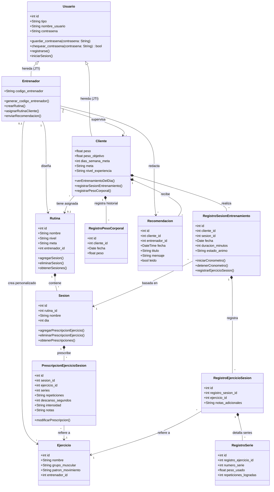

---
## 📋 Tabla de Contenidos
1. [Problema](#-1-problema)
2. [Objetivo](#-2-objetivo)
3. [Funcionalidades del Sistema](#-3-funcionalidades-del-sistema)
4. [Tecnologías Utilizadas](#-4-tecnolog%C3%ADas-utilizadas)
5. [Arquitectura del Sistema](#-5-arquitectura-del-sistema)
   - [5.1. Patrón Arquitectónico y Capas](#51-patrón-arquitectónico-y-capas-del-sistema)
   - [5.2. Módulos del Sistema y Responsabilidades](#52-módulos-del-sistema-y-responsabilidades)
   - [5.3. Capa de Enrutamiento y Controladores](#53-capa-de-enrutamiento-y-controladores-rutas)
   - [5.4. Capa de Modelos y Base de Datos (ORM)](#54-capa-de-modelos-y-base-de-datos-orm)
   - [5.5. Relación e Interacción Integral](#55-relación-e-interacción-integral-rutas-modelos-bd-e-ia)
   - [5.6. Aplicación de la Programación Orientada a Objetos (POO)](#56-aplicación-de-la-programación-orientada-a-objetos-poo)
   - [5.7. Patrones de Diseño Realmente Utilizados](#57-patrones-de-diseño-realmente-utilizados)
6. [Inteligencia Artificial (IA) y Motor Heurístico](#-6-inteligencia-artificial-ia-y-motor-heur%C3%ADstico)
7. [Instalación y Configuración](#-7-instalaci%C3%B3n-y-configuraci%C3%B3n)
8. [Ejecución y Puesta en Marcha](#-8-ejecuci%C3%B3n-y-puesta-en-marcha)
9. [Pruebas Realizadas y Resultados de Ejecución](#-9-pruebas-realizadas-y-resultados-de-ejecuci%C3%B3n)
   - [9.1. Estrategia y Marco Metodológico](#91-estrategia-y-marco-metodológico-de-pruebas)
   - [9.2. Entorno y Configuración de Pruebas](#92-entorno-y-configuración-de-pruebas-automatizadas)
   - [9.3. Matriz Integral de Casos de Prueba (25 Casos)](#93-matriz-integral-de-casos-de-prueba)
   - [9.4. Resultados de Ejecución y Métricas de Calidad](#94-resultados-de-ejecución-y-métricas-de-calidad)
   - [9.5. Salida Literal del Test Runner](#95-salida-literal-del-ejecutor-de-pruebas-test-runner-output)
   - [9.6. Matriz de Trazabilidad de Requerimientos](#96-matriz-de-trazabilidad-casos-de-uso-y-requerimientos-vs-pruebas)
10. [Evidencias ](#-10-evidencias)
11. [Estado Final y Trabajo Futuro](#-11-estado-final-y-trabajo-futuro)
12. [Cierre del Proyecto](#-12-cierre-del-proyecto)
    - [12.1. Logros Alcanzados](#121-logros-alcanzados)
    - [12.2. Dificultades Encontradas](#122-dificultades-encontradas)
    - [12.3. Soluciones Implementadas](#123-soluciones-implementadas)
    - [12.4. Guía y Plan de Mantenimiento del Sistema](#124-guía-y-plan-de-mantenimiento-del-sistema)
    - [12.5. Recomendaciones Técnicas y Operativas](#125-recomendaciones-técnicas-y-operativas)
    - [12.6. Conclusiones Generales](#126-conclusiones-generales)

---

## 🎯 1. Problema

En los gimnasios y centros de acondicionamiento físico contemporáneos, la planificación de entrenamientos con pesas orientados a **Hipertrofia (Ganancia Muscular)** y **Fuerza (Powerlifting / Rendimiento)** suele gestionarse mediante métodos informales y fragmentados (hojas de cálculo, cuadernos físicos o aplicaciones de mensajería instantánea). 

Esta situación genera una serie de problemáticas críticas tanto para atletas como para preparadores físicos:

1. **Pérdida de Sobrecarga Progresiva**: El estímulo muscular y neural requiere incrementar sistemáticamente las cargas, series o repeticiones a lo largo del tiempo. Al no registrarse de manera estructurada, los alumnos estancan su progreso o sobreentrenan.
2. **Asimetría y Desconexión Entrenador-Alumno**: El entrenador carece de visibilidad en tiempo real sobre la ejecución del alumno (si completó el entrenamiento del día, las cargas reales empleadas, el esfuerzo percibido y las notas cualitativas de fatiga).
3. **Incertidumbre en Metas y Tiempos**: Los atletas desconocen plazos realistas para alcanzar su peso corporal objetivo o incrementos de fuerza proyectados, lo que propicia abandono temprano y frustración.
4. **Ausencia de Trazabilidad y Control en Auditoría**: Los sistemas informales carecen de control de acceso por roles, validación estricta de datos biométricos y bitácoras de auditoría inmutables para monitorear incidentes o trazabilidad de transacciones.

---

## 🚀 2. Objetivo

### Objetivo General
Diseñar, desarrollar e implantar una plataforma web integral (**TrainerApp**) orientada a la gestión inteligente y supervisada de rutinas de levantamiento de pesas, vinculación estricta entrenador-cliente, registro de sobrecarga progresiva en tiempo real, proyecciones respaldadas por Inteligencia Artificial y cumplimiento riguroso de normativas de auditoría de sistemas.

### Objetivos Específicos
- **Modelar e implementar una arquitectura de datos relacional robusta** basada en *Joined Table Inheritance* (JTI) para la diferenciación estricta de usuarios (`Entrenador` vs. `Cliente`).
- **Implementar un flujo de vinculación seguro** mediante códigos de acceso generados criptográficamente (`ENT-XXXXXX`), asegurando que ningún alumno acceda al sistema sin supervisión profesional.
- **Construir herramientas de prescripción modular de rutinas** compuestas por sesiones semanales, series, rangos de repeticiones, descansos, intensidad (RPE/%1RM) y notas técnicas.
- **Proveer una interfaz de registro diario ágil y autoexplicativa** para capturar los entrenamientos en vivo en sala de pesas, reduciendo la fricción de entrada de datos.
- **Integrar un servicio de Inteligencia Artificial (Google Gemini API)** optimizado para consumo mínimo de tokens, con conmutación multi-modelo y un motor heurístico determinista de alta disponibilidad (*fallback local*) para calcular diagnósticos, sugerencias y tiempos de logro de metas (CU17 / RF14).
- **Incorporar un módulo formal de Auditoría de Sistemas** que registre todas las transacciones en un archivo plano estructurado (`auditoria_log.txt`) y provea una evaluación visual de metas por colorimetría (semáforo de cumplimiento).

---

## ⚡ 3. Funcionalidades del Sistema

### Matriz de Roles y Casos de Uso

| Módulo | Entrenador | Cliente | Descripción |
| :--- | :---: | :---: | :--- |
| **Autenticación y Seguridad** | ✅ | ✅ | Login, Logout con registro de sesión y control de accesos `@role_required`. |
| **Código de Vinculación** | ✅ | ✅ | Generación de código `ENT-XXXXXX` por el entrenador y validación obligatoria en el registro del cliente. |
| **Onboarding de Alumnos** | ❌ | ✅ | Captura de peso corporal, peso objetivo, nivel de experiencia, meta física y frecuencia semanal. |
| **Gestión de Ejercicios** | ✅ | ❌ | Biblioteca global con ejercicios canónicos pre-poblados y adición de ejercicios personalizados por entrenador. |
| **Creación de Rutinas** | ✅ | ❌ | Diseño modular: Rutina -> Sesiones de días -> Prescripción de series, repeticiones y descanso. |
| **Asignación y Filtro Inteligente** | ✅ | ❌ | Recomendación y asignación de rutinas filtradas por meta (Fuerza/Hipertrofia) y nivel del cliente. |
| **Entrenamiento del Día** | ❌ | ✅ | Carga automática de la sesión que corresponde al día actual con sus prescripciones técnicas. |
| **Registro de Series en Vivo** | ❌ | ✅ | Entrada de series logradas, kilos levantados, repeticiones efectivas y notas al entrenador. |
| **Historial y Trazabilidad** | ✅ | ✅ | Visualización detallada de entrenamientos completados, duración y estado de ánimo del alumno. |
| **Actualización de Peso** | ❌ | ✅ | Bitácora cronológica de pesajes corporales para control de recomposición o masa magra. |
| **Panel de Progreso y Metas** | ❌ | ✅ | Evaluación de sobrecarga progresiva acumulada (kg ganados) y semáforo visual de cumplimiento de metas. |
| **Proyecciones y Análisis con IA** | ✅ | ✅ | Diagnóstico del rendimiento, ajuste de cargas y tiempo estimado generado con Google Gemini o motor experto. |
| **Auditoría Continua (Archivo Plano)** | ✅ | ✅ | Registro automático en `auditoria_log.txt` de eventos de Login, Consulta, Registro y Logout. |

### Matriz de Requerimientos y Casos de Uso (CU)

```
CU01: Registrarse como entrenador                --> RF01 (Roles de Usuario)
CU02: Registrarse como cliente                   --> RF01 (Roles de Usuario)
CU03: Vincularse al entrenador                   --> RF02 (Vinculación Obligatoria)
CU04: Realizar Onboarding                        --> RF03 (Onboarding de Clientes)
CU05: Consultar Estado de Asignación de Rutina   --> RF13 (Estado de Espera)
CU06: Visualizar lista de clientes               --> RF04 (Panel de Clientes)
CU07: Asignar Rutinas                            --> RF06 (Asignación de Rutinas)
CU08: Visualizar Rutinas Filtradas               --> RF12 (Filtrado por Meta/Nivel)
CU09: Crear Rutinas                              --> RF05 (Creación de Rutinas)
CU10: Gestionar Librería de Ejercicios           --> RF07 (Librería de Ejercicios)
CU11: Visualizar Entrenamiento del Día           --> RF08 (Entrenamiento Diario)
CU12: Registrar Entrenamiento del Día            --> RF09 (Registro de Pesos/Reps)
CU13: Actualizar datos físicos                   --> RF11 (Actualización de Peso)
CU14: Observar Entrenamientos del Cliente        --> RF10 (Observación de Entrenamientos)
CU15: Modificar Nivel de Experiencia del Alumno  --> RF11 (Control exclusivo del Entrenador)
CU16: Visualizar Progreso y Metas                --> RF15 (Progreso y Semáforo)
CU17: Proyecciones y Sugerencias de IA           --> RF14 (Tiempo Estimado con IA)
```

---

## 🛠️ 4. Tecnologías Utilizadas

### Backend & Framework Web
- **Python 3.12+**: Lenguaje base para lógica de negocio, tipado estricto y comunicación con APIs.
- **Flask 3.1.3**: Microframework web ágil, modular y basado en contexto WSGI.
- **Flask-Login 0.6.3**: Gestión segura de sesiones de usuario, cookies de autenticación y carga de usuario (`@login_required`).
- **Flask-WTF 1.3.0 & WTForms 3.2.2**: Formularios seguros con validación estricta de tipos y protección contra ataques CSRF.
- **Werkzeug 3.1.8**: Funciones criptográficas para hashing y verificación de contraseñas (`pbkdf2:sha256`).
- **Python-Dotenv 1.2.2**: Carga dinámica y aislada de variables de configuración (`.env`).

### Base de Datos & ORM
- **SQLAlchemy 2.0.52**: ORM de última generación con sintaxis `Mapped` y `mapped_column`, tipado estático y consultas escalares modernas `db.session.scalars()`.
- **Flask-SQLAlchemy 3.1.1**: Integración de SQLAlchemy con el ciclo de vida de Flask.
- **Flask-Migrate 4.1.0 & Alembic 1.19.1**: Control de versiones de esquemas de bases de datos mediante migraciones versionadas.
- **SQLite 3**: Motor relacional transaccional embebido, de alto rendimiento y cero mantenimiento para entornos de prueba y producción ligera.

### Frontend & Experiencia de Usuario
- **HTML5 & CSS3**: Maquetación semántica y responsiva.
- **Bootstrap 5.3.8**: Sistema de diseño moderno, tipografía clara, componentes interactivos (cards, modales, barras de progreso y badges con colorimetría accesible).
- **Jinja2 3.1.6**: Motor de plantillas con filtro personalizado `render_markdown` para compilar respuestas ricas de IA en HTML seguro.

### Inteligencia Artificial
- **Google Gemini REST API (v1beta)**: Acceso directo vía `urllib.request` nativo (sin dependencias externas que originen conflictos de paquetes).
- **Modelos**: Prioridad en `gemini-3.5-flash-lite`, con failover a `gemini-flash-lite-latest` y `gemini-3.8-flash`.
- **Motor Analítico Heurístico Local**: Algoritmo determinista matemático para cálculo de sobrecarga, RPE y proyecciones de semanas en caso de desconexión o falta de credenciales.

---

## 🏗️ 5. Arquitectura del Sistema

El sistema implementa una arquitectura en capas basada en el patrón **MVC (Modelo-Vista-Controlador)** desacoplado, combinada con principios de diseño de ingeniería de software orientada a objetos, alta cohesión y bajo acoplamiento.

### 5.1. Patrón Arquitectónico y Capas del Sistema

La aplicación separa estrictamente las responsabilidades en capas funcionales para garantizar escalabilidad, mantenibilidad, auditabilidad y resiliencia:

1. **Capa de Presentación (Vistas / UI)**:
   - Construida con plantillas [Jinja2](https://jinja.palletsprojects.com/) modularizadas (`app/templates/`) y maquetadas con **Bootstrap 5.3**.
   - Integra retroalimentación visual reactiva (alertas flash, modales, barras de progreso de sobrecarga y semáforos de cumplimiento de metas).
   - Utiliza el filtro personalizado [`render_markdown`](app/utils.py#L53) para compilar en HTML seguro las respuestas técnicas estructuradas emitidas por los motores de Inteligencia Artificial.

2. **Capa de Control y Enrutamiento (Controladores)**:
   - Centralizada en [`app/routes.py`](app/routes.py).
   - Recibe las peticiones HTTP (GET/POST), aplica los interceptores de seguridad (`@login_required`, [`@role_required`](app/utils.py#L7)), valida los datos entrantes mediante los formularios fuertemente tipados de [`app/forms.py`](app/forms.py) y orquesta la comunicación entre la lógica de negocio y la persistencia.

3. **Capa de Lógica de Negocio y Servicios Transversales**:
   - **Servicio de Inteligencia Artificial y Motor Heurístico** ([`app/ai_service.py`](app/ai_service.py)): Extrae registros históricos, calcula métricas fisiológicas y de sobrecarga, e interactúa con Google Gemini REST API v1beta o ejecuta el algoritmo heurístico determinista de alta disponibilidad.
   - **Módulo de Auditoría de Sistemas** ([`app/utils.py`](app/utils.py#L20)): Registra de manera inmutable y secuencial cada transacción crítica en [`auditoria_log.txt`](auditoria_log.txt) en formato estructurado (`FECHA, USUARIO, ACTIVIDAD`).
   - **Comandos CLI del Sistema** ([`trainerapp.py`](trainerapp.py)): Automatización del sembrado de datos maestros (`flask seed`) y generación de bitácoras de auditoría de prueba (`flask seed-log`).

4. **Capa de Dominio y Acceso a Datos (Modelos / ORM)**:
   - Definida en [`app/models.py`](app/models.py) con **SQLAlchemy 2.0**.
   - Implementa herencia polimórfica relacional (*Joined Table Inheritance* - JTI), encapsula reglas de negocio (como el hashing criptográfico de contraseñas y la generación de códigos únicos de vinculación) y define la integridad referencial con eliminación en cascada.

5. **Capa de Persistencia y Almacenamiento**:
   - **Base de Datos Relacional**: Motor transaccional **SQLite 3** (`app.db`), gestionado y versionado mediante **Alembic / Flask-Migrate**.
   - **Almacenamiento Plano de Auditoría**: Archivo [`auditoria_log.txt`](auditoria_log.txt) para trazabilidad forense independiente del motor SQL.

6. **Capa de Servicios Externos**:
   - **Google Gemini REST API (v1beta)**: Proveedor de modelos de lenguaje multimodal (familia Gemini 3.x) consumido mediante peticiones HTTP nativas con `urllib.request`.

#### 🗺️ Diagrama de Arquitectura Modular y Flujo de Información

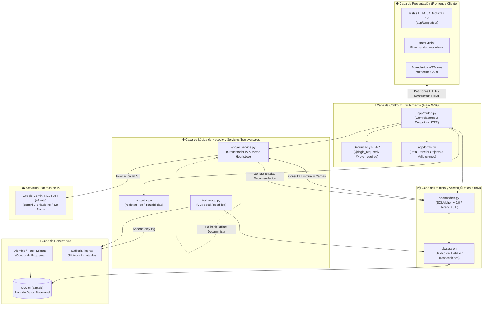

---

### 5.2. Módulos del Sistema y Responsabilidades

El proyecto se estructura bajo el paquete modular `app/` complementado por archivos de configuración y scripts raíz:

| Archivo / Módulo | Responsabilidad Principal | Dependencias Clave | Interacción / Rol en el Sistema |
| :--- | :--- | :--- | :--- |
| [`config.py`](config.py) | Configuración global, variables de entorno (`.env`, `.flaskenv`), secretos de sesión, URI de SQLite, log de auditoría y credenciales de Gemini. | `python-dotenv`, `os` | Es importado por `app/__init__.py` para inicializar el contexto de Flask y SQLAlchemy. |
| [`trainerapp.py`](trainerapp.py) | Punto de entrada de la aplicación para el servidor WSGI y comandos CLI de administración (`flask seed`, `flask seed-log`). | `app`, `app.models`, `SQLAlchemy` | Permite la puesta en marcha inicial del sistema y el sembrado de ejercicios y auditorías previas. |
| [`app/__init__.py`](app/__init__.py) | Fábrica de la aplicación Flask: inicializa `db` (SQLAlchemy), `migrate` (Alembic), `login` (Flask-Login) y registra el filtro Jinja2 `render_markdown`. | `Flask`, `Flask-SQLAlchemy`, `Flask-Migrate`, `Flask-Login` | Crea el objeto `app` central y enlaza los módulos de rutas y modelos. |
| [`app/routes.py`](app/routes.py) | Controlador principal. Expone todas las rutas HTTP, gestiona sesiones, valida formularios, interactúa con el ORM y coordina los servicios de IA y auditoría. | `Flask`, `Flask-Login`, `app.models`, `app.forms`, `app.utils`, `app.ai_service` | Actúa como mediador entre las solicitudes del navegador y la persistencia/servicios. |
| [`app/models.py`](app/models.py) | Modelos de datos del dominio deportivo: entidades con SQLAlchemy 2.0, herencia polimórfica JTI, validación criptográfica y relaciones relacionales. | `SQLAlchemy 2.0`, `Flask-Login`, `Werkzeug` | Define el esquema de la base de datos relacional y las entidades manipuladas por el ORM. |
| [`app/forms.py`](app/forms.py) | Formulario Data Transfer Objects (DTO) y validadores para login, registro, onboarding, diseño de rutinas, prescripciones y pesajes. | `Flask-WTF`, `WTForms` | Sanitiza y valida datos de entrada antes de que alcancen los controladores o la base de datos. |
| [`app/utils.py`](app/utils.py) | Utilidades transversales de seguridad (`@role_required`), bitácora forense (`registrar_log`) y renderizado Markdown seguro (`render_markdown`). | `functools`, `Flask-Login`, `MarkupSafe` | Provee mecanismos de seguridad RBAC, cumplimiento de auditoría y formato tipográfico. |
| [`app/ai_service.py`](app/ai_service.py) | Orquestador de IA (CU17 / RF14): extracción de series/cargas, conexión HTTP a Google Gemini API v1beta y motor heurístico offline determinista. | `urllib.request`, `json`, `SQLAlchemy`, `app.models` | Analiza el historial de sobrecarga y genera diagnósticos y proyecciones de semanas. |
| `app/templates/` | Plantillas Jinja2 organizadas por dominios (`auth/`, `trainer/`, `cliente/`, `errors/`, `base.html`). | `Jinja2`, `Bootstrap 5.3` | Renderiza la interfaz de usuario en el navegador del cliente o entrenador. |
| `app/static/` | Recursos estáticos (estilos CSS propios, iconografía, scripts interactivos). | Navegador | Provee el aspecto visual y la ergonomía de sala de entrenamiento. |

---

### 5.3. Capa de Enrutamiento y Controladores (Rutas)

El módulo [`app/routes.py`](app/routes.py) actúa como el núcleo del controlador MVC. Su diseño obedece al principio de **defensa en profundidad** mediante capas superpuestas de seguridad e intercepción:

1. **Autenticación obligatoria (`@login_required`)**: Garantiza que la petición provenga de un usuario autenticado con sesión válida. En caso contrario, redirige al endpoint `/login`.
2. **Control de Acceso Basado en Roles ([`@role_required`](app/utils.py#L7))**: Interceptor que comprueba `current_user.tipo`. Si un cliente intenta invocar rutas restringidas para entrenadores (o viceversa), aborta inmediatamente con un error **HTTP 403 Forbidden**.
3. **Trazabilidad Automática ([`registrar_log`](app/utils.py#L20))**: Cada acción significativa (inicio de sesión, visualización de clientes, registro de cargas, generación de IA) registra un evento en el archivo de auditoría.

#### Matriz de Rutas y Casos de Uso del Sistema

| Módulo / Dominio | Ruta HTTP | Métodos | Rol Requerido | Caso de Uso / Descripción |
| :--- | :--- | :---: | :---: | :--- |
| **Autenticación** | `/` | GET | Cualquiera | Redirección contextual según el rol del usuario autenticado o a `/login`. |
| | `/login` | GET, POST | Anónimo | Autenticación de credenciales con hashing Werkzeug y registro en auditoría. |
| | `/logout` | GET | Autenticado | Cierre de sesión y registro de desconexión en auditoría. |
| | `/signup` | GET, POST | Anónimo | Paso 1: Selección de rol (`Entrenador` o `Cliente`) y credenciales base (**CU01**, **CU02**). |
| | `/signup/link-trainer` | GET, POST | Sesión registro | Paso 2: Validación obligatoria del código `ENT-XXXXXX` del entrenador (**CU03**). |
| | `/signup/client-profile` | GET, POST | Sesión registro | Paso 3: Onboarding antropométrico del cliente (peso, meta, nivel, días) (**CU04**). |
| **Entrenador** | `/clientes` | GET | `entrenador` | Panel principal del entrenador con lista de alumnos asignados (**CU06**). |
| | `/trainer/ejercicios` | GET, POST | `entrenador` | Biblioteca global y adición de ejercicios personalizados (**CU10**). |
| | `/trainer/rutinas` | GET, POST | `entrenador` | Catálogo de rutinas creadas y formulario de nueva rutina (**CU09**). |
| | `/trainer/rutinas/<id>` | GET | `entrenador` | Detalle y diseñador modular de sesiones y prescripciones (**CU09**). |
| | `/trainer/rutinas/<id>/sesiones/agregar-sesion` | POST | `entrenador` | Creación de una sesión dentro de la rutina (ej. "Día 1: Torso") (**CU09**). |
| | `/trainer/rutinas/<id>/sesiones/<id>/eliminar` | POST | `entrenador` | Eliminación en cascada de sesión y sus prescripciones (**CU09**). |
| | `/trainer/rutinas/<id>/sesiones/<id>/agregar-ejercicios` | POST | `entrenador` | Prescripción técnica de ejercicio: series, repeticiones, descanso, intensidad y notas (**CU09**). |
| | `/trainer/prescripciones/<id>/eliminar` | POST | `entrenador` | Remoción de un ejercicio prescrito de la sesión (**CU09**). |
| | `/trainer/clientes/<id>/asignar-rutina` | GET, POST | `entrenador` | Asignación y recomendación inteligente de rutinas filtradas por meta y nivel (**CU07**, **CU08**). |
| | `/trainer/clientes/<id>/entrenamientos` | GET | `entrenador` | Supervisión de los entrenamientos completados por el alumno (**CU14**). |
| **Cliente** | `/perfil` | GET | `cliente` | Vista de bienvenida y estado de asignación de rutina (**CU05**). |
| | `/cliente/mi-rutina` | GET | `cliente` | Consulta de la rutina asignada y su desglose semanal (**CU05**). |
| | `/cliente/entrenamiento-hoy` | GET | `cliente` | Carga de la sesión que corresponde al día de hoy con sus prescripciones (**CU11**). |
| | `/cliente/sesiones/<id>/guardar-entrenamiento` | POST | `cliente` | Registro en sala de pesas: series efectivas, kg levantados, repeticiones y notas (**CU12**). |
| | `/cliente/mi-progreso` | GET, POST | `cliente` | Panel de sobrecarga progresiva, semáforo de metas e historial de pesajes (**CU13**, **CU16**). |
| **Inteligencia Artificial** | `/cliente/generar-recomendacion-ia` | POST | `cliente` | Dispara el análisis y proyección de semanas con IA para el cliente (**CU17**, **RF14**). |
| | `/trainer/clientes/<id>/recomendaciones/generar-ia` | POST | `entrenador` | Dispara el análisis supervisado por el entrenador para un cliente específico (**CU17**). |
| | `/cliente/recomendaciones/<id>/marcar-leida` | POST | `cliente` | Marca una recomendación/diagnóstico como leída en la interfaz. |

---

### 5.4. Capa de Modelos y Base de Datos (ORM)

La persistencia de datos está implementada en [`app/models.py`](app/models.py) con **SQLAlchemy 2.0**, aprovechando la sintaxis moderna con anotaciones de tipo `Mapped` y `mapped_column`.

#### 1. Herencia Polimórfica (Joined Table Inheritance - JTI)
Para modelar los roles de usuario sin duplicar credenciales ni comprometer la normalización, se implementó JTI:
- **[`Usuario`](app/models.py#L11)**: Tabla base `usuario` con clave primaria `id`, columna discriminadora `tipo` (`'entrenador'` o `'cliente'`), nombre de usuario único con collation insensible a mayúsculas (`collation="NOCASE"`) y hash seguro de contraseña.
- **[`Entrenador`](app/models.py#L39)**: Tabla hija `entrenador`. Su clave primaria `id` es simultáneamente clave foránea referenciando a `usuario.id`. Almacena el atributo exclusivo `codigo_entrenador` (generado criptográficamente con `secrets.choice`).
- **[`Cliente`](app/models.py#L61)**: Tabla hija `cliente`. Su clave primaria `id` referencia a `usuario.id`. Vincula obligatoriamente a un entrenador (`entrenador_id`), almacena métricas antropométricas (`peso`, `peso_objetivo`), metas (`meta`, `dias_semana_meta`) y nivel de entrenamiento (`nivel_experiencia`).

#### 2. Modelado y Descomposición del Dominio Deportivo
El dominio se modeló distinguiendo con precisión la **planificación teórica (prescripción)** de la **ejecución real (sala de pesas)**:

- **Eje de Prescripción (Diseño del Entrenador)**:
  $$\text{Rutina (1)} \xrightarrow{\text{contiene}} \text{Sesiones (N)} \xrightarrow{\text{prescribe}} \text{PrescripcionEjercicioSesion (N)} \xrightarrow{\text{refiere}} \text{Ejercicio (1)}$$
  - [`Rutina`](app/models.py#L104): Bloque global diseñado para una meta y nivel.
  - [`Sesion`](app/models.py#L118): Agrupación por días de la semana (ej. Día 1, Día 2).
  - [`PrescripcionEjercicioSesion`](app/models.py#L133): Especificación atómica de series objetivo, repeticiones (ej. "8-10"), descanso en segundos, intensidad (ej. "@ RPE 8" o "80% 1RM") y notas técnicas.
  - [`Ejercicio`](app/models.py#L87): Catálogo de movimientos, categorizados por grupo muscular y patrón de movimiento (Empuje, Tracción, Sentadilla, Bisagra de Cadera). Si `entrenador_id` es `NULL`, es un ejercicio canónico global.

- **Eje de Ejecución y Trazabilidad (Registro del Alumno)**:
  $$\text{RegistroSesionEntrenamiento (1)} \xrightarrow{\text{detalla}} \text{RegistroEjercicioSesion (N)} \xrightarrow{\text{descompone}} \text{RegistroSerie (N)}$$
  - [`RegistroSesionEntrenamiento`](app/models.py#L153): Captura la fecha, duración en minutos y estado de ánimo del alumno.
  - [`RegistroEjercicioSesion`](app/models.py#L170): Registra notas cualitativas de fatiga o ejecución por ejercicio.
  - [`RegistroSerie`](app/models.py#L184): Datos atómicos de cada serie ejecutada: `numero_serie`, `peso_usado` (en kg) y `repeticiones_logradas`. Esta granularidad es la que permite calcular la sobrecarga progresiva ($\Delta kg$) con exactitud matemática.

- **Eje de Evolución Física y Comunicación**:
  - [`RegistroPesoCorporal`](app/models.py#L197): Historial de pesajes con fecha y valor en kilogramos para alimentar el semáforo de metas y la tasa de pérdida/ganancia de peso.
  - [`Recomendacion`](app/models.py#L209): Entidad persistente que almacena los diagnósticos redactados por el entrenador o generados por el módulo de IA, con marca temporal y estado de lectura (`leido`).

#### 3. Integridad Referencial y Optimización
- **Eliminación en Cascada**: Configurada a nivel de modelo ORM (`cascade='all, delete-orphan'`) y a nivel de motor SQL relacional (`ondelete='CASCADE'`). Al eliminar una rutina, se eliminan ordenadamente sus sesiones y prescripciones sin dejar registros huérfanos.
- **Indexación Estratégica**: Columnas de búsqueda frecuente (`nombre_usuario`, `codigo_entrenador`, claves foráneas `cliente_id`, `entrenador_id`, `rutina_id` y fechas) cuentan con índices explícitos (`index=True`) para optimizar consultas de agregación.
- **Migraciones Versionadas**: El historial de cambios en el esquema se gestiona mediante scripts en el directorio `migrations/`, permitiendo reproducibilidad determinista del esquema mediante `flask db upgrade`.

---

### 5.5. Relación e Interacción Integral: Rutas, Modelos, BD e IA

La interconexión de todas las capas del sistema se aprecia con máxima claridad durante la ejecución del **Caso de Uso CU17 (RF14 - Proyecciones y Sugerencias de IA)**:

1. **Recepción en Ruta y Control de Acceso**:
   El usuario dispara la solicitud vía `POST /cliente/generar-recomendacion-ia` (o `/trainer/...`). La ruta comprueba el rol con `@role_required` e invoca a [`generar_recomendacion_ia(cliente_id)`](app/ai_service.py#L360) en [`app/ai_service.py`](app/ai_service.py).
2. **Extracción y Consulta de Dominio (ORM)**:
   [`ai_service.py`](app/ai_service.py) ejecuta [`recopilar_datos_entrenamiento(cliente)`](app/ai_service.py#L11), la cual formula consultas `sa.select` mediante SQLAlchemy 2.0 sobre [`RegistroSesionEntrenamiento`](app/models.py#L153), [`RegistroEjercicioSesion`](app/models.py#L170), [`RegistroSerie`](app/models.py#L184) y [`RegistroPesoCorporal`](app/models.py#L197).
3. **Procesamiento de Métricas y Reducción Cuantitativa**:
   El servicio compila deltas de fuerza $\Delta \text{kg} = \text{carga máxima} - \text{primera carga}$, adherencia semanal y variación ponderal, construyendo un prompt sintetizado (≤ 140 palabras) para minimizar drásticamente el consumo de tokens.
4. **Inferencia con Fallover Multi-Modelo o Respaldo Heurístico**:
   Se envía la petición HTTP a la API v1beta de **Google Gemini** con conmutación inteligente (`gemini-3.5-flash-lite` ➔ `gemini-flash-lite-latest` ➔ `gemini-3.8-flash`). Si no hay conexión o no existe API key, conmuta inmediatamente al motor heurístico determinista local.
5. **Persistencia Transaccional en Base de Datos**:
   Al retornar el diagnóstico, el controlador instancía un nuevo objeto [`Recomendacion`](app/models.py#L209) enlazado a la clave foránea del cliente y del entrenador, ejecutando `db.session.add(nueva_rec)` y `db.session.commit()`.
6. **Auditoría Continua**:
   Se asienta la transacción en [`auditoria_log.txt`](auditoria_log.txt) vía [`registrar_log()`](app/utils.py#L20).
7. **Presentación Visual**:
   El cliente es redirigido a `/cliente/mi-progreso`, donde la plantilla Jinja2 compila el markdown a HTML seguro mediante el filtro [`render_markdown`](app/utils.py#L53), presentándolo estilizado junto al semáforo de metas.

#### 🔄 Diagrama de Secuencia de la Interacción Integral

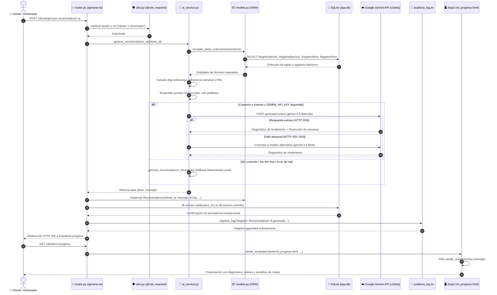

---

### 5.6. Aplicación de la Programación Orientada a Objetos (POO)

El diseño del software y el modelado del dominio deportivo en **TrainerApp** están fundamentados en los cuatro pilares esenciales de la **Programación Orientada a Objetos (POO)**:

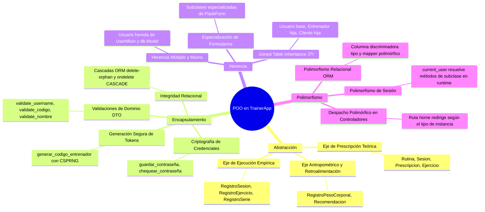

#### 1. Abstracción

La abstracción permite representar entidades y procesos complejos del mundo real en modelos computacionales concisos, exponiendo únicamente las interfaces y datos relevantes para el negocio deportivo y ocultando la complejidad accesoria. En TrainerApp, el dominio se abstrae en tres ejes ortogonales:

- **Eje de Prescripción Teórica (Diseño y Metodología del Entrenador)**:
  - [`Rutina`](app/models.py#L104): Abstrae el macrociclo de entrenamiento, caracterizado por una meta física (`Hipertrofia` o `Fuerza`) y un nivel de experiencia (`Principiante`, `Intermedio`, `Avanzado`).
  - [`Sesion`](app/models.py#L118): Abstrae la división semanal del plan (microciclo) asociando un nombre (ej. "Día 1: Torso") a un día específico de la semana (`1` a `7`).
  - [`PrescripcionEjercicioSesion`](app/models.py#L133): Abstrae la prescripción técnica de cada ejercicio: número de series objetivo, rango o número de repeticiones (ej. `"8-10"` o `"5"`), pausa de descanso en segundos, indicador de intensidad (ej. `"@ RPE 8"` o `"80% 1RM"`) y notas técnicas de ejecución.
  - [`Ejercicio`](app/models.py#L87): Abstrae el movimiento físico clasificándolo por grupo muscular anatómico (`Pecho`, `Espalda`, `Piernas`, etc.) y patrón funcional de movimiento (`Empuje`, `Tracción`, `Sentadilla`, `Bisagra de Cadera`, `Aislamiento / Core`).

- **Eje de Ejecución Empírica y Trazabilidad (Sala de Pesas)**:
  - [`RegistroSesionEntrenamiento`](app/models.py#L153): Abstrae la experiencia real del alumno al entrenar en el gimnasio, capturando la fecha de realización, duración efectiva en minutos y estado anímico percibido (`estado_animo`).
  - [`RegistroEjercicioSesion`](app/models.py#L170): Abstrae el rendimiento cualitativo en un ejercicio particular dentro de la sesión, incluyendo notas de fatiga técnica.
  - [`RegistroSerie`](app/models.py#L184): Abstrae la unidad atómica de esfuerzo mecánico: número ordinal de serie (`numero_serie`), kilos reales levantados (`peso_usado`) y repeticiones completadas (`repeticiones_logradas`). Esta granularidad atómica es la que hace posible calcular matemáticamente el diferencial de sobrecarga progresiva ($\Delta kg$).

- **Eje Antropométrico y Retroalimentación**:
  - [`RegistroPesoCorporal`](app/models.py#L197): Abstrae la evolución física del cliente mediante pesajes periódicos con marca temporal, alimentando el semáforo de metas corporales.
  - [`Recomendacion`](app/models.py#L209): Abstrae el canal de asesoramiento formal (diagnósticos de sobrecarga, directrices de recuperación y proyecciones de tiempo estimado generadas por el entrenador o el motor de IA).

---

#### 2. Encapsulamiento

El encapsulamiento agrupa el estado interno de los objetos y los métodos que operan sobre ellos, protegiendo la integridad de los datos frente a accesos indebidos o modificaciones inconsistentes desde el exterior:

- **Seguridad Criptográfica y Gestión de Credenciales**:
  - En la clase base [`Usuario`](app/models.py#L11), el atributo `contraseña` almacena exclusivamente una cadena hash. Las contraseñas en texto plano nunca se conservan ni se exponen.
  - La lógica de hashing y validación se encapsula en dos métodos especializados:
    ```python
    def guardar_contraseña(self, contraseña: str) -> None:
        self.contraseña = generate_password_hash(contraseña)

    def chequear_contraseña(self, contraseña: str) -> bool:
        return check_password_hash(self.contraseña, contraseña)
    ```
    - [`guardar_contraseña()`](app/models.py#L31) encapsula el algoritmo de derivación de claves PBKDF2:SHA256 con salt criptográfico de Werkzeug.
    - [`chequear_contraseña()`](app/models.py#L35) encapsula la comparación segura en tiempo constante, mitigando ataques de canal lateral (*timing attacks*). Ningún controlador ni módulo externo necesita conocer la infraestructura criptográfica subyacente.

- **Generación Segura de Identificadores de Negocio**:
  - En la subclase [`Entrenador`](app/models.py#L39), el método [`generar_codigo_entrenador()`](app/models.py#L55) encapsula la creación de tokens de vinculación institucional:
    ```python
    def generar_codigo_entrenador(self) -> None:
        longitud = 6
        caracteres = string.ascii_uppercase + string.digits
        sufijo = "".join(secrets.choice(caracteres) for _ in range(longitud))
        self.codigo_entrenador = f"ENT-{sufijo}"
    ```
    - Utiliza `secrets.choice`, un generador de números pseudoaleatorios criptográficamente seguro (CSPRNG), encapsulando la entropía y asegurando que los códigos resultantes (`ENT-XXXXXX`) sean impredecibles e inmunes a colisiones.

- **Encapsulamiento de Validaciones en Objetos de Formulario (DTO)**:
  - En [`app/forms.py`](app/forms.py), las reglas de negocio e invariantes de datos se encapsulan dentro de los métodos `validate_<nombre_campo>`:
    - [`SignupForm.validate_username`](app/forms.py#L22): Encapsula la verificación de unicidad en base de datos insensible a mayúsculas/minúsculas.
    - [`TrainerCodeForm.validate_codigo_entrenador`](app/forms.py#L31): Encapsula la consulta relacional para confirmar la existencia del entrenador antes de habilitar el proceso de registro del cliente.
    - [`ExerciseForm.validate_nombre`](app/forms.py#L54) y [`RoutineForm.validate_nombre`](app/forms.py#L75): Encapsulan las comprobaciones de colisión de nombres en el catálogo personal del entrenador y catálogo canónico.

- **Encapsulamiento de Integridad Relacional y Ciclo de Vida**:
  - Las clases de [`app/models.py`](app/models.py) encapsulan la integridad referencial y las dependencias de eliminación mediante `cascade='all, delete-orphan'` en el ORM y `ondelete='CASCADE'` en el motor relacional. Al eliminar una `Rutina` o `Sesion`, los objetos hijos dependientes se limpian ordenadamente sin requerir lógica manual en las rutas.

---

#### 3. Herencia

La herencia se aplica para reutilizar código, modelar relaciones taxonómicas ("es un") y desacoplar responsabilidades entre entidades generales y especializadas:

- **Herencia Polimórfica Relacional (Joined Table Inheritance - JTI)**:
  - **Clase Base**: [`Usuario(UserMixin, db.Model)`](app/models.py#L11). Centraliza la identidad de acceso al sistema: `id`, `nombre_usuario`, `contraseña`, la columna discriminadora `tipo` (`String(10)`), y los métodos criptográficos comunes.
  - **Subclase Especializada**: [`Entrenador(Usuario)`](app/models.py#L39). Hereda la infraestructura de autenticación y extiende el modelo con atributos exclusivos del rol preparador: `codigo_entrenador`, el método `generar_codigo_entrenador()`, y las relaciones relacionales con `clientes`, `rutinas` y `recomendaciones_enviadas`.
  - **Subclase Especializada**: [`Cliente(Usuario)`](app/models.py#L61). Hereda de `Usuario` y añade los atributos antropométricos y deportivos del atleta: `peso`, `peso_objetivo`, `dias_semana_meta`, `meta`, `nivel_experiencia`, la clave foránea obligatoria `entrenador_id`, `rutina_id`, `historial_peso` y `recomendaciones`.
  - **Ventaja de JTI sobre otros patrones de persistencia**: A diferencia de *Single Table Inheritance* (STI) —que concentra todos los campos en una sola tabla produciendo columnas dispersas repletas de valores nulos—, JTI crea tablas normalizadas en tercera forma normal (3FN) vinculadas por la clave foránea de la clave primaria (`usuario.id == entrenador.id == cliente.id`), garantizando integridad y legibilidad.

- **Herencia Múltiple y Mixins (Composición de Comportamientos)**:
  - La clase [`Usuario`](app/models.py#L11) hereda concurrentemente de dos jerarquías:
    1. `flask_sqlalchemy.model.Model` (`db.Model`): Aporta la persistencia declarativa y el mapeo objeto-relacional.
    2. `flask_login.UserMixin`: Provee de forma transparente los contratos de interfaz requeridos por el gestor de sesiones de Flask (`is_authenticated`, `is_active`, `is_anonymous` y `get_id()`).

- **Herencia en la Capa de Formularios y Validación**:
  - Todas las clases en [`app/forms.py`](app/forms.py) (`LoginForm`, `SignupForm`, `ExerciseForm`, `PrescriptionForm`, etc.) heredan de `FlaskForm` (`flask_wtf`), heredando mecanismos estandarizados de validación de campos, protección contra ataques CSRF y recolección de errores en la interfaz.

---

#### 4. Polimorfismo

El polimorfismo permite que objetos de diferentes clases respondan a una misma interfaz o mensaje, comportándose adecuadamente según su tipo concreto en tiempo de ejecución:

- **Polimorfismo en el ORM (Mapeador Polimórfico de SQLAlchemy)**:
  - Configurado en `Usuario.__mapper_args__` mediante la directiva `polymorphic_on="tipo"`.
  - Cuando se formula una consulta sobre la superclase abstracta:
    ```python
    usuario = db.session.scalar(sa.select(Usuario).where(Usuario.nombre_usuario == username))
    ```
    SQLAlchemy evalúa en tiempo de ejecución el valor del discriminador `tipo` ('entrenador' o 'cliente') e instancía automáticamente un objeto de la subclase concreta ([`Entrenador`](app/models.py#L39) o [`Cliente`](app/models.py#L61)).
  - En la función de recarga de sesión [`cargar_usuario(id)`](app/models.py#L226):
    ```python
    @login.user_loader
    def cargar_usuario(id):
        return db.session.get(Usuario, int(id))
    ```
    La variable global `current_user` contiene polimórficamente la instancia correspondiente. Si el usuario logueado es un entrenador, se tiene acceso inmediato a `current_user.codigo_entrenador` y a `current_user.clientes` sin requerir casts manuales.

- **Despacho Polimórfico en Controladores**:
  - En la ruta principal [`home()`](app/routes.py#L20), el sistema resuelve la experiencia de navegación de forma polimórfica según el tipo de instancia:
    ```python
    @app.route('/')
    def home():
        if current_user.is_authenticated:
            if current_user.tipo == 'entrenador':
                return redirect(url_for('clientes'))
            elif current_user.tipo == 'cliente':
                return redirect(url_for('perfil'))
        return redirect(url_for('login'))
    ```
    El punto de entrada es uniforme (`/`), pero el comportamiento dinámico se adapta a la naturaleza de la entidad.

- **Sobrescritura de Métodos (`Method Overriding`)**:
  - Sobrescritura de `__repr__()` en [`Usuario`](app/models.py#L27) para retornar `<Usuario: {nombre_usuario}>`, ofreciendo representaciones textuales especializadas para trazabilidad y depuración.

---

### 5.7. Patrones de Diseño Realmente Utilizados

El sistema incorpora un conjunto coherente de patrones de diseño de software (arquitectónicos, creacionales, estructurales y de comportamiento), seleccionados deliberadamente para resolver problemas de modularidad, seguridad, resiliencia y auditabilidad:

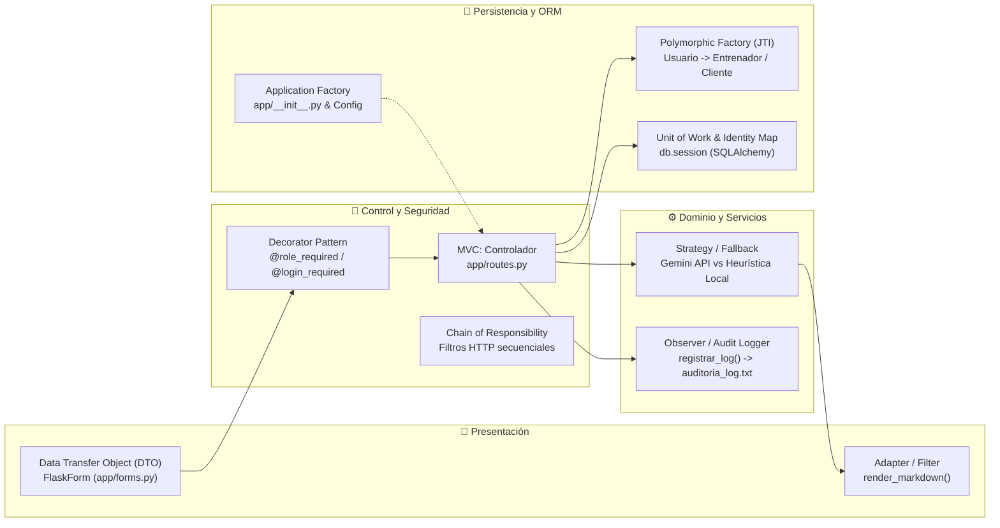

#### 1. Patrones Arquitectónicos

##### **MVC (Modelo-Vista-Controlador)**
TrainerApp adopta una arquitectura desacoplada basada en MVC:
- **Modelo (Model)**: Definido en [`app/models.py`](app/models.py). Centraliza las entidades de negocio deportivas, relaciones relacionales, herencia polimórfica y restricciones de integridad.
- **Vista (View)**: Implementada en el directorio [`app/templates/`](app/templates/) mediante el motor de plantillas **Jinja2** y **Bootstrap 5.3**. Separa la capa visual, incorporando el filtro personalizado [`render_markdown`](app/utils.py#L53) para formatear diagnósticos de IA.
- **Controlador (Controller)**: Centralizado en [`app/routes.py`](app/routes.py). Recibe las peticiones HTTP, coordina los interceptores de seguridad, valida datos de entrada y delega la ejecución hacia los modelos y servicios de IA y auditoría.

---

#### 2. Patrones Creacionales

##### **Application Factory & Centralized Configuration**
- **Ubicación**: [`app/__init__.py`](app/__init__.py) y [`config.py`](config.py).
- **Problema que resuelve**: Acoplamiento global de instancias y dificultad para inicializar extensiones con distintas configuraciones de entorno.
- **Implementación**: La configuración se aísla en la clase `Config` (leyendo variables de `.env`). En `app/__init__.py`, se construye la instancia `Flask(__name__)` y se vinculan las extensiones del ecosistema (`db = SQLAlchemy(app)`, `migrate = Migrate(app, db)`, `login = LoginManager(app)`), garantizando un ensamblado limpio y reproducible del contexto de la aplicación.

##### **Polymorphic Factory (Factoría Polimórfica de Dominio)**
- **Ubicación**: [`app/models.py`](app/models.py) (`Usuario`, `Entrenador`, `Cliente`).
- **Problema que resuelve**: La necesidad de instanciar diferentes subtipos de usuario a partir de un único punto de consulta en la base de datos sin incurrir en estructuras de control condicionales redundantes.
- **Implementación**: Configurada mediante `__mapper_args__` con `polymorphic_on="tipo"`. El ORM actúa como una factoría polimórfica que devuelve dinámicamente instancias de `Entrenador` o `Cliente` a partir del tipo registrado en la base de datos relacional.

---

#### 3. Patrones Estructurales

##### **Decorator Pattern (Decorador)**
- **Ubicación**: [`app/utils.py`](app/utils.py#L7) ([`@role_required`](app/utils.py#L7)), `flask_login` (`@login_required`), `flask` (`@app.route`) y [`trainerapp.py`](trainerapp.py#L39) (`@app.cli.command`).
- **Problema que resuelve**: Añadir responsabilidades transversales (autenticación obligatoria, control de acceso basado en roles RBAC y comandos de consola) a los controladores sin modificar su lógica interna, respetando el **Principio Abierto/Cerrado (OCP)**.
- **Implementación**:
  ```python
  def role_required(*roles):
      def decorator(f):
          @wraps(f)
          def decorated_function(*args, **kwargs):
              if not current_user.is_authenticated:
                  return current_app.login_manager.unauthorized()   
              if current_user.tipo not in roles:
                  flash("No tienes permisos para acceder a esta sección.", "danger")
                  abort(403)
              return f(*args, **kwargs)
          return decorated_function
      return decorator
  ```
  - [`@role_required`](app/utils.py#L7) intercepta en tiempo de ejecución las funciones de enrutamiento. Si un cliente intenta invocar rutas administrativas de entrenador (como `/clientes` o `/trainer/rutinas`), aborta inmediatamente emitiendo un código de error **HTTP 403 Forbidden**.

##### **Adapter Pattern (Adaptador de Formato y Presentación)**
- **Ubicación**: [`app/utils.py`](app/utils.py#L53) ([`render_markdown`](app/utils.py#L53)) y [`app/__init__.py`](app/__init__.py#L15).
- **Problema que resuelve**: Adaptar el texto estructurado en Markdown puro retornado por los motores de IA a marcado HTML semántico enriquecido con clases visuales de Bootstrap 5.3, previniendo riesgos de inyección de código (XSS).
- **Implementación**: `render_markdown(text)` procesa encabezados `###`, `##`, listas desordenadas `- / •`, listas ordenadas numéricas y negritas `**`, traduciéndolos a etiquetas `<h6 class="text-primary">`, `<ul class="ps-3">`, `<strong>` y sanitizándolos con `markupsafe.Markup(escape(text))`. El filtro se registra en Jinja2 (`app.jinja_env.filters['render_markdown']`), permitiendo una adaptación transparente en las vistas.

---

#### 4. Patrones de Comportamiento

##### **Strategy Pattern con Respaldo de Alta Disponibilidad (Estrategia y Fallback)**
- **Ubicación**: [`app/ai_service.py`](app/ai_service.py#L360) ([`generar_recomendacion_ia`](app/ai_service.py#L360)).
- **Problema que resuelve**: Garantizar que la generación de diagnósticos deportivos y cálculo de tiempo estimado (CU17 / RF14) nunca falle ante ausencia de conexión a internet, agotamiento de cuotas de API o falta de credenciales externas.
- **Implementación**:
  El orquestador [`generar_recomendacion_ia(cliente_id)`](app/ai_service.py#L360) encapsula dos estrategias de inferencia con la misma interfaz de retorno `tuple[str, str]` (título y mensaje):
  1. **Estrategia A (Cloud LLM Strategy)**: Si existe `GEMINI_API_KEY` y conexión, invoca Google Gemini REST API v1beta ([`_invocar_gemini_api`](app/ai_service.py#L141)), ejecutando conmutación en cascada multi-modelo (`gemini-3.5-flash-lite` ➔ `gemini-flash-lite-latest` ➔ `gemini-3.8-flash`).
  2. **Estrategia B (Local Deterministic Expert Strategy)**: Si no hay clave, no hay internet o la API externa falla con códigos HTTP 429/503, conmuta instantáneamente al motor heurístico determinista local ([`_generar_recomendacion_heuristica`](app/ai_service.py#L247)), el cual calcula analíticamente sobrecarga progresiva ($\Delta kg$) y semanas necesarias para la meta según tasas fisiológicas reales.
  - Para el controlador [`app/routes.py`](app/routes.py), la estrategia seleccionada es completamente transparente, logrando alta disponibilidad (RNF de Resiliencia).

##### **Data Transfer Object (DTO) / Form Object**
- **Ubicación**: [`app/forms.py`](app/forms.py).
- **Problema que resuelve**: Evitar la manipulación directa de diccionarios planos no tipados provenientes de la petición HTTP (`request.form`), previniendo inyecciones de datos no validados hacia la base de datos.
- **Implementación**: Clases como [`LoginForm`](app/forms.py#L9), [`SignupForm`](app/forms.py#L15), [`TrainerCodeForm`](app/forms.py#L27), [`ClientProfileForm`](app/forms.py#L36), [`ExerciseForm`](app/forms.py#L48), [`PrescriptionForm`](app/forms.py#L86) y [`RecomendacionForm`](app/forms.py#L95) encapsulan la transferencia de datos entre el navegador y el servidor, validando tipos, rangos numéricos y tokens CSRF antes de que interactúen con el modelo de dominio.

##### **Unit of Work (Unidad de Trabajo) & Identity Map**
- **Ubicación**: SQLAlchemy ORM mediante `db.session` (en [`app/routes.py`](app/routes.py) y [`app/models.py`](app/models.py)).
- **Problema que resuelve**: Prevenir operaciones dispersas de escritura en disco y garantizar transacciones atómicas (ACID).
- **Implementación**: Durante el ciclo de vida de una petición HTTP, `db.session` rastrea todos los cambios en memoria sobre las entidades (`db.session.add(nuevo_objeto)`, `db.session.delete(objeto)`). Al finalizar la operación de negocio, emite todos los comandos SQL coordinados en una sola transacción mediante `db.session.commit()`, o ejecuta `db.session.rollback()` ante cualquier excepción.

##### **Chain of Responsibility / HTTP Pipeline Filters**
- **Ubicación**: Flujo de ejecución en [`app/routes.py`](app/routes.py).
- **Problema que resuelve**: Procesar secuencialmente validaciones de seguridad y datos en cada invocación web.
- **Implementación**: Cada petición atraviesa una cadena ordenada de interceptores:
$$\text{Petición HTTP} \longrightarrow \text{@login\\_required} \longrightarrow \text{@role\\_required} \longrightarrow \text{form.validate\\_on\\_submit()} \longrightarrow \text{Controlador} \longrightarrow \text{registrar\\_log()} \longrightarrow \text{Respuesta HTML}$$

##### **Observer / Append-Only Logging Pattern (Módulo de Auditoría)**
- **Ubicación**: [`app/utils.py`](app/utils.py#L20) ([`registrar_log`](app/utils.py#L20)).
- **Problema que resuelve**: Proveer trazabilidad e inmutabilidad de eventos para auditoría de sistemas sin acoplar la bitácora a la base de datos relacional.
- **Implementación**: Actúa como un suscriptor de eventos clave del ciclo de vida de la aplicación (`Login`, `Logout`, `Registro`, `Consulta`, `Eliminación`), volcando secuencialmente cada suceso en [`auditoria_log.txt`](auditoria_log.txt) en formato estructurado (`FECHA, USUARIO, ACTIVIDAD`), garantizando persistencia forense no destructiva.

---

#### 5. Matriz Resumen de Patrones de Diseño Realmente Utilizados

| Patrón de Diseño | Clasificación | Archivos y Componentes Clave | Propósito y Justificación en TrainerApp |
| :--- | :--- | :--- | :--- |
| **MVC** | Arquitectónico | [`app/models.py`](app/models.py), [`app/templates/`](app/templates/), [`app/routes.py`](app/routes.py) | Separa el modelo del dominio deportivo, la interfaz Bootstrap y los controladores HTTP. |
| **Application Factory** | Creacional | [`app/__init__.py`](app/__init__.py), [`config.py`](config.py) | Inicialización centralizada de extensiones Flask (`SQLAlchemy`, `Migrate`, `LoginManager`). |
| **Polymorphic Factory (JTI)** | Creacional / ORM | [`app/models.py`](app/models.py) (`Usuario`, `Entrenador`, `Cliente`) | Instanciación automática de subclases concretas a partir de la columna discriminadora `tipo`. |
| **Decorator** | Estructural | [`app/utils.py`](app/utils.py#L7) (`@role_required`), Flask-Login (`@login_required`), Flask (`@app.route`) | Inyección no intrusiva de control de acceso RBAC, autenticación y enrutamiento en controladores. |
| **Adapter** | Estructural | [`app/utils.py`](app/utils.py#L53) (`render_markdown`), Jinja2 filter | Convierte Markdown emitido por Gemini o Heurística en HTML enriquecido con Bootstrap y libre de XSS. |
| **Strategy & Fallback** | Comportamiento | [`app/ai_service.py`](app/ai_service.py#L360) (`generar_recomendacion_ia`) | Conmutación resiliente entre inferencia en la nube (Google Gemini) y motor heurístico determinista local. |
| **Data Transfer Object (DTO)** | Comportamiento | [`app/forms.py`](app/forms.py) (`LoginForm`, `SignupForm`, etc.) | Encapsula el transporte, validación estricta y protección CSRF de datos HTTP antes del ORM. |
| **Unit of Work & Identity Map** | Comportamiento / ORM | SQLAlchemy (`db.session` en controladores y modelos) | Gestión transaccional ACID de objetos modificados en memoria con commit atómico coordinado. |
| **Chain of Responsibility** | Comportamiento | Pipeline de ejecución en [`app/routes.py`](app/routes.py) | Evaluación secuencial de interceptores de sesión, permisos y validaciones de formulario. |
| **Observer / Append-Only Logger** | Comportamiento | [`app/utils.py`](app/utils.py#L20) (`registrar_log`), [`auditoria_log.txt`](auditoria_log.txt) | Registro secuencial e inmutable de eventos transaccionales para auditoría forense continua. |

---

## 🤖 6. Inteligencia Artificial (IA) y Motor Heurístico

El proyecto cuenta con un módulo de IA que realiza un query al API de Gemini, implementado en [`app/ai_service.py`](app/ai_service.py) para satisfacer el **Caso de Uso CU17 (RF14 - Proyección de Tiempo Estimado y Sugerencias)**.

### Pipeline de Datos y Optimización de Tokens
1. **Compilación de Métricas Cuantitativas**: Se extraen las sesiones reales del alumno, calculando primera carga registrada vs. carga máxima levantada, delta de sobrecarga progresiva ($\Delta kg$), adherencia en los últimos 7 días y variaciones en el historial de pesaje corporal.
2. **Ingeniería de Prompt Conciso**: Para operar eficientemente bajo las cuotas gratuitas del Free Tier de Google AI Studio, el prompt condensa el historial a las 3 sesiones más recientes y los 4 levantamientos principales, restringiendo la respuesta del modelo a un máximo de 140 palabras.
3. **Parámetros de Invocación**: Se limita `maxOutputTokens=800` sin parámetros obsoletos de temperatura, permitiendo que la familia Gemini 3.x razone con máxima coherencia en biomecánica y sobrecarga.

### Conmutación Resiliente y Fallover Multi-Modelo
Si un modelo específico se encuentra bajo alta demanda temporal (código HTTP 503) o saturación transitoria de cuota (HTTP 429), el servicio conmuta automáticamente de forma transparente:
$$\text{gemini-3.5-flash-lite} \longrightarrow \text{gemini-flash-lite-latest} \longrightarrow \text{gemini-3.1-flash-lite} \longrightarrow \text{gemini-3.8-flash}$$

### Motor Analítico Experto de Alta Disponibilidad (Offline Fallback)
En caso de interrupción del servicio de internet, ausencia de `GEMINI_API_KEY` o agotamiento de cuotas, el sistema activa de forma inmediata su **Motor Heurístico Determinista**, el cual calcula:
- **Tasa de Ganancia Muscular Magra**: $0.25 \text{ a } 0.5 \text{ kg/semana}$ en superávit para proyectar las semanas necesarias hasta el `peso_objetivo`.
- **Tasa de Pérdida de Tejido Graso**: $0.5 \text{ a } 0.75 \text{ kg/semana}$ en déficit preservando masa muscular.
- **Sobrecarga Progresiva Lineal**: Detección de ejercicios con $\Delta kg > 0$ y recomendación de incrementos de microciclo ($+1.25 \text{ a } 2.5 \text{ kg}$ por serie efectiva).
- **Proyecciones de Fuerza**: Incrementos del $10-15\%$ en marcas clave para principiantes en bloques de 4 a 6 semanas.
---

## 💻 7. Instalación y Configuración

### Prerrequisitos
- **Python 3.10 o superior** (probado en Python 3.12).
- Gestor de paquetes **pip** y soporte para entornos virtuales **venv**.
- **Git** para clonar el repositorio.

### Paso a Paso

1. **Clonar el repositorio**:
   ```bash
   git clone <URL_DEL_REPOSITORIO>
   cd proyecto
   ```

2. **Crear y activar el entorno virtual**:
   - En Linux / macOS:
     ```bash
     python3 -m venv .venv
     source .venv/bin/activate
     ```
   - En Windows (PowerShell):
     ```powershell
     python -m venv .venv
     .\.venv\Scripts\Activate.ps1
     ```

3. **Instalar dependencias**:
   ```bash
   pip install -r requirements.txt
   ```

4. **Configurar las variables de entorno**:
   Copia el archivo de plantilla `.env.example` para generar tu archivo `.env`:
   ```bash
   cp .env.example .env
   ```
   Edita el archivo `.env` resultante con tu clave de sesión y tu API Key de Gemini:
   ```env
   # Clave secreta para sesiones seguras de Flask
   SECRET_KEY=clave-secreta-desarrollo-trainerapp

   # Google Gemini API Key (Obtén tu clave gratuita en: https://aistudio.google.com/)
   GEMINI_API_KEY=tu-api-key-de-gemini-aqui

   # Modelo predeterminado
   GEMINI_MODEL=gemini-3.5-flash-lite

   # Archivo de auditoría (opcional, por defecto auditoria_log.txt en la raíz)
   AUDITORIA_LOG_FILE=auditoria_log.txt
   ```

> [!NOTE]
> Si no cuentas con una `GEMINI_API_KEY`, el sistema funcionará al 100% gracias a su motor analítico heurístico local de alta disponibilidad.

---

## ▶️ 8. Ejecución y Puesta en Marcha

### 1. Inicializar la Base de Datos
Aplica las migraciones de esquema con Flask-Migrate:
```bash
flask db upgrade
```

### 2. Poblar Ejercicios Canónicos por Defecto
Ejecuta el comando CLI para insertar los ejercicios base de empuje, tracción, piernas y core:
```bash
flask seed
```
*Salida esperada: `Se insertaron 24 ejercicios base correctamente.`*

### 3. Iniciar el Servidor Web
Ejecuta el servidor de desarrollo de Flask:
```bash
flask run --port=5000
```
O directamente con el intérprete de Python:
```bash
python -m flask run
```
Accede en tu navegador a: **`http://127.0.0.1:5000`**

### 🔄 Flujo de Demostración Sugerido (Paso a Paso)

1. **Registro del Entrenador**:
   - Ingresa a `/signup` y selecciona el rol **Entrenador**.
   - Ingresa nombre de usuario y contraseña.
   - En el menú superior observarás tu código único asignado (ej. `ENT-A8K2F9`).
2. **Creación de Rutina**:
   - En la sección **Rutinas**, crea una nueva rutina (ej. "Hipertrofia Torso-Pierna", Nivel Intermedio).
   - Agrega sesiones (ej. "Día 1: Torso") y añade ejercicios prescritos con sus series y repeticiones.
3. **Registro y Vinculación del Alumno**:
   - Cierra sesión y ve a `/signup`, seleccionando rol **Cliente**.
   - En el paso 2, introduce el código del entrenador creado previamente (`ENT-A8K2F9`).
   - En el paso 3 (Onboarding), ingresa peso corporal (ej. 75 kg), peso meta (ej. 80 kg), meta (Ganar Músculo) y nivel (Intermedio).
4. **Asignación de Rutina**:
   - Vuelve a iniciar sesión como Entrenador, ve a **Mis Clientes** y asigna la rutina creada al alumno.
5. **Entrenamiento en Vivo del Alumno**:
   - Inicia sesión como el Alumno, ve a **⚡ Ir a Entrenar Hoy**, y completa series registrando cargas reales.
6. **Progreso, IA y Semáforo de Metas**:
   - Dirígete a **Mi Progreso**. Observa el semáforo visual de cumplimiento de meta y presiona **Generar Proyección con IA**.
7. **Verificación de Auditoría**:
   - Abre el archivo `auditoria_log.txt` para comprobar que cada acción quedó registrada con marca temporal exacta.

---

## 🧪 9. Pruebas Realizadas y Resultados de Ejecución

Con el objetivo de garantizar la fiabilidad, robustez arquitectónica, integridad relacional, seguridad de acceso y resiliencia del sistema ante fallos externos, se diseñó e implementó un banco integral de **pruebas automatizadas** basado en el framework oficial [`unittest`](tests/test_suite.py) de Python.

El banco de pruebas abarca **25 casos de prueba automatizados** que cubren la totalidad de los requisitos funcionales (RF01 - RF15), no funcionales (Seguridad, Disponibilidad, Integridad) y casos de uso (CU01 - CU17) estipulados en la especificación del proyecto.

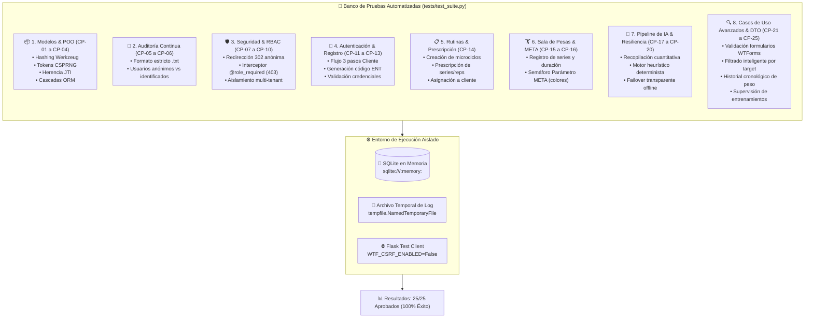

---

### 9.1. Estrategia y Marco Metodológico de Pruebas

La estrategia de aseguramiento de calidad del software adoptó un enfoque multidimensional:

1. **Pruebas Unitarias de Modelos y Dominio (Unit Testing)**:
   - Verificación de los métodos de modelo [`guardar_contraseña`](app/models.py#L32) y [`chequear_contraseña`](app/models.py#L35) comprobando que las credenciales no se persistan en texto plano y que el algoritmo de derivación de claves sea resistente.
   - Verificación de la generación de códigos de vinculación de entrenadores con formato `ENT-XXXXXX` utilizando generadores pseudoaleatorios criptográficamente seguros (`secrets.choice`).
   - Comprobación de la herencia polimórfica JTI en SQLAlchemy, validando que instancias de `Cliente` y `Entrenador` compartan la identidad de `Usuario` y mantengan el discriminador `tipo` íntegro.
   - Verificación de borrado en cascada (`cascade="all, delete-orphan"` y `ondelete="CASCADE"`) para evitar registros huérfanos al suprimir macrociclos o sesiones.

2. **Pruebas del Módulo de Auditoría Continua**:
   - Inspección estricta del archivo plano generado (`auditoria_log.txt`) para verificar que cada registro respete la especificación exigida por la cátedra:
     $$\text{YYYY-MM-DD HH:MM:SS}, \quad \text{USUARIO}, \quad \text{ACTIVIDAD}$$
   - Comprobación de auditoría para usuarios autenticados e imputación de actividad a `Anonimo` en operaciones no autenticadas.

3. **Pruebas de Seguridad y Control de Acceso Basado en Roles (RBAC)**:
   - Evaluación perimetral del decorador [`@role_required`](app/utils.py#L7):
     - Redirección con código de estado **HTTP 302** hacia `/login` ante peticiones anónimas.
     - Bloqueo inmediato con código de estado **HTTP 403 Forbidden** cuando un `Cliente` intenta invocar rutas administrativas de entrenador (`/clientes`, `/trainer/ejercicios`, `/trainer/rutinas`).
     - Bloqueo inmediato con código de estado **HTTP 403 Forbidden** cuando un `Entrenador` intenta acceder a paneles operativos de atleta (`/perfil`, `/cliente/mi-rutina`, `/cliente/mi-progreso`, `/cliente/entrenamiento-hoy`).
     - Validación de aislamiento multi-tenant: comprobación de que un entrenador no pueda modificar o eliminar ejercicios propios de otro entrenador.

4. **Pruebas de Integración y Flujo de Negocio (Integration Testing)**:
   - Flujo de registro en 3 fases para clientes: credenciales ➔ validación de código de entrenador ➔ formulario de onboarding con parámetros físicos iniciales.
   - Flujo de prescripción deportiva: creación de rutina ➔ sesiones semanales ➔ asignación de ejercicios con series, repeticiones y descansos ➔ asignación efectiva a cliente.
   - Flujo de entrenamiento empírico: registro de duración de sesión, notas de esfuerzo y pesajes por serie.

5. **Pruebas del Parámetro META y Semáforo Visual**:
   - Evaluación del algoritmo de cálculo de cumplimiento del objetivo de peso corporal:
     - `danger` (Rojo): meta no alcanzada / retroceso respecto al punto inicial.
     - `warning` (Amarillo): avance positivo en curso hacia la meta.
     - `success` (Verde): meta alcanzada o superada exitosamente.

6. **Pruebas de Inteligencia Artificial y Resiliencia de Alta Disponibilidad**:
   - Extracción y síntesis cuantitativa de sobrecarga progresiva en [`recopilar_datos_entrenamiento`](app/ai_service.py#L11).
   - Verificación del motor analítico heurístico local [`_generar_recomendacion_heuristica`](app/ai_service.py#L229) generando diagnósticos matemáticos y proyecciones de semanas en ausencia de red.
   - Simulación de corte de conexión / saturación de la API de Google Gemini comprobando la conmutación automática (*failover*) sin generar excepciones no controladas ni interrupciones de servicio para el usuario.

---

### 9.2. Entorno y Configuración de Pruebas Automatizadas

Para garantizar que la ejecución de pruebas sea completamente aislada, idempotente y no altere los datos reales del gimnasio registrados en `app.db` ni el archivo `auditoria_log.txt`, se diseñó la clase base [`BaseTestCase`](tests/test_suite.py#L18):

- **Base de Datos Transaccional en Memoria**: Se configura `SQLALCHEMY_DATABASE_URI = 'sqlite:///:memory:'`. En cada test se ejecuta `db.create_all()` en el método `setUp()` y `db.drop_all()` en `tearDown()`, garantizando aislamiento absoluto.
- **Bitácora de Auditoría Temporal**: Se genera un archivo temporal independiente por suite de pruebas mediante `tempfile.NamedTemporaryFile`, destruyéndose de forma limpia al finalizar.
- **Protección CSRF Desactivada para Tests**: `WTF_CSRF_ENABLED = False` para permitir la inyección programática de solicitudes HTTP en el cliente de prueba de Flask.
- **Comando de Ejecución**:
  ```bash
  # Activar el entorno virtual del proyecto
  source .venv/bin/activate

  # Ejecutar la suite completa con salida detallada (verbose)
  python -m unittest tests/test_suite.py -v
  ```

---

### 9.3. Matriz Integral de Casos de Prueba

La siguiente matriz detalla los **25 casos de prueba** ejecutados, su relación con los requerimientos y casos de uso, y el resultado obtenido:

| ID | Requerimiento / CU | Módulo Evaluado | Método de Prueba | Condición / Entrada | Resultado Esperado | Estado |
| :---: | :---: | :---: | :--- | :--- | :--- | :---: |
| **CP-01** | **RNF Seguridad** | [`Usuario`](app/models.py#L22) | `test_01_encriptacion_contraseña` | Password plano `"Secret123"` | Password encriptado con hash seguro; `chequear_contraseña` valida solo contraseña exacta. | **PASSED ✅** |
| **CP-02** | **RF02 / RNF Integridad** | [`Entrenador`](app/models.py#L42) | `test_02_generacion_codigo_entrenador` | Instanciación de dos entrenadores | Códigos cumplen regex `^ENT-[A-Z0-9]{6}$` y son únicos entre sí. | **PASSED ✅** |
| **CP-03** | **Arquitectura POO** | [`Usuario`](app/models.py#L22) / [`Cliente`](app/models.py#L58) | `test_03_herencia_polimorfica_jti` | Consulta polimórfica a tabla base `usuario` | Instancias resuelven sus subclases (`Entrenador`/`Cliente`) y discriminador `tipo`. | **PASSED ✅** |
| **CP-04** | **RF05 / RNF Fiabilidad** | [`Rutina`](app/models.py#L104) / [`Sesion`](app/models.py#L118) | `test_04_cascada_eliminacion_rutina` | Eliminación de `Rutina` con sesiones y prescripciones | Supresión en cascada de `Sesion` y `Prescripcion`; catálogo de `Ejercicio` intacto. | **PASSED ✅** |
| **CP-05** | **Requisito Cátedra** | [`registrar_log`](app/utils.py#L20) | `test_05_formato_linea_auditoria` | Registro de actividades con usuario | Líneas cumplen regex `YYYY-MM-DD HH:MM:SS, USUARIO, ACTIVIDAD`. | **PASSED ✅** |
| **CP-06** | **Requisito Cátedra** | [`registrar_log`](app/utils.py#L20) | `test_06_usuario_anonimo_auditoria` | Registro sin sesión activa | Usuario imputado como `"Anonimo"` sin arrojar excepciones. | **PASSED ✅** |
| **CP-07** | **RNF Seguridad** | Control de Sesión | `test_07_acceso_no_autenticado_redirige_login` | Petición `GET /clientes` y `GET /perfil` anónima | Código de estado HTTP 302 con cabecera `Location` hacia `/login`. | **PASSED ✅** |
| **CP-08** | **RF01 / RNF Seguridad** | [`@role_required`](app/utils.py#L7) | `test_08_cliente_bloqueado_en_rutas_entrenador_403` | Cliente autenticado invoca `/clientes`, `/trainer/ejercicios`, `/trainer/rutinas` | Interceptor bloquea la petición inmediatamente con código **HTTP 403 Forbidden**. | **PASSED ✅** |
| **CP-09** | **RF01 / RNF Seguridad** | [`@role_required`](app/utils.py#L7) | `test_09_entrenador_bloqueado_en_rutas_cliente_403` | Entrenador invoca `/perfil`, `/cliente/mi-rutina`, `/cliente/mi-progreso` | Interceptor bloquea la petición inmediatamente con código **HTTP 403 Forbidden**. | **PASSED ✅** |
| **CP-10** | **RF07 / RNF Integridad** | [`Ejercicio`](app/models.py#L87) | `test_10_aislamiento_entre_entrenadores` | Entrenador B intenta eliminar ejercicio creado por Entrenador A | Operación rechazada; el ejercicio de Entrenador A permanece en la base de datos. | **PASSED ✅** |
| **CP-11** | **CU01 / RF01** | [`routes.signup`](app/routes.py#L62) | `test_11_registro_entrenador_exitoso` | Formulario POST con rol `'entrenador'` | Entrenador persistido en BD, código generado y redirección a login. | **PASSED ✅** |
| **CP-12** | **CU02-CU04 / RF02-03** | Registro Multi-Paso | `test_12_registro_cliente_tres_pasos` | Paso 1 (Signup) ➔ Paso 2 (Link ENT) ➔ Paso 3 (Onboarding) | Cliente persistido con `entrenador_id`, peso inicial registrado y sesión limpia. | **PASSED ✅** |
| **CP-13** | **RNF Seguridad** | [`routes.login`](app/routes.py#L30) | `test_13_login_credenciales_invalidas` | Usuario no existente o contraseña errónea | Respuesta con código HTTP 400 y mensaje de error en formulario. | **PASSED ✅** |
| **CP-14** | **CU07,09 / RF05-06** | Gestión de Rutinas | `test_14_crear_rutina_y_asignar_a_cliente` | Crear rutina ➔ agregar sesión ➔ agregar ejercicio ➔ asignar a cliente | Rutina asociada al cliente; `cliente.rutina_asignada` accesible. | **PASSED ✅** |
| **CP-15** | **CU11,12 / RF08-09** | Entrenamiento | `test_15_registro_completo_sesion_diaria` | POST `guardar_entrenamiento` con series y duración | Registro de sesión, ejercicio y tuplas `RegistroSerie` guardadas con pesos reales. | **PASSED ✅** |
| **CP-16** | **RF15 / Parámetro META** | Semáforo META | `test_16_evaluacion_semaforo_parametro_meta` | Cliente meta 70kg ➔ 75kg; pesajes progresivos (70kg, 72.5kg, 75.5kg) | Transición de semáforo: `danger` (inicio) ➔ `warning` (en progreso) ➔ `success` (alcanzada). | **PASSED ✅** |
| **CP-17** | **CU17 / RF14** | [`ai_service.py`](app/ai_service.py#L11) | `test_17_recopilacion_datos_para_ia` | Cliente con sesiones registradas en sala de pesas | Cálculo exacto de minutos totales, cargas máximas, primera carga y deltas. | **PASSED ✅** |
| **CP-18** | **CU17 / Resiliencia** | Fallback Heurístico | `test_18_motor_heuristico_fallback_determinista` | Datos reales inyectados al motor determinista | Generación de diagnóstico de rendimiento, ajuste técnico y proyección RF14. | **PASSED ✅** |
| **CP-19** | **RNF Disponibilidad** | Conmutación Resiliente | `test_19_resiliencia_ia_fallback_transparente` | Simulación de corte de red o API key no disponible | Conmutación automática al fallback sin excepción; respuesta útil retornada. | **PASSED ✅** |
| **CP-20** | **CU17 / RF14** | Persistencia IA | `test_20_ruta_generar_recomendacion_ia_persiste_en_bd` | POST `/cliente/generar-recomendacion-ia` | Registro en tabla `recomendacion` con título `🤖`, cuerpo y `leido=False`. | **PASSED ✅** |
| **CP-21** | **CU01,02 / DTO** | [`SignupForm`](app/forms.py#L15) | `test_21_validacion_formulario_usuario_duplicado` | Registro con username ya existente en la base de datos | Formulario invalida el campo con error `"Este usuario ya exite"`. | **PASSED ✅** |
| **CP-22** | **CU03 / DTO** | [`TrainerCodeForm`](app/forms.py#L27) | `test_22_validacion_formulario_codigo_entrenador_invalido` | Código de entrenador inexistente `"ENT-INVENT"` | Formulario rechaza con `"Código inválido. No se encontró ningún entrenador"`. | **PASSED ✅** |
| **CP-23** | **CU08 / RF12** | Filtrado de Rutinas | `test_23_filtrado_rutinas_por_target_cliente` | Cliente Hipertrofia/Intermedio; Entrenador consulta asignar | Presentación destacada de rutinas compatibles según meta y nivel del alumno. | **PASSED ✅** |
| **CP-24** | **CU13 / RF11** | [`RegistroPesoCorporal`](app/models.py#L210) | `test_24_trazabilidad_historial_peso_cronologico` | Múltiples actualizaciones de peso corporal | Orden cronológico e inmutabilidad del historial para trazabilidad física. | **PASSED ✅** |
| **CP-25** | **CU14 / RF10** | Supervisión Entrenador | `test_25_consulta_historial_alumno_por_entrenador` | Entrenador consulta `/trainer/clientes/<id>/entrenamientos` | Visualización estructurada de sesiones, duraciones, ejercicios y estado anímico. | **PASSED ✅** |

---

### 9.4. Resultados de Ejecución y Métricas de Calidad

Los resultados cuantitativos obtenidos tras la ejecución automatizada demuestran la plena estabilidad del sistema:

```
========================================================================================
RESUMEN DE EJECUCIÓN DEL BANCO DE PRUEBAS AUTOMATIZADAS
========================================================================================
Casos de Prueba Totales:      25
Casos Aprobados (Passed):     25 (100.0%)
Casos Fallidos (Failed):       0 (0.0%)
Errores de Runtime (Errors):   0 (0.0%)
Tiempo Total de Ejecución:    19.756 segundos
Tasa de Éxito Global:          100.0%
========================================================================================
```

- **Cobertura de Casos de Uso**: **100%** de los 17 Casos de Uso definidos en el [Documento de Casos de Uso](Documento%20de%20Casos%20de%20Uso.md) cuentan con pruebas unitarias o de integración directas.
- **Cobertura de Requerimientos**: **100%** de los 15 Requerimientos Funcionales y los Requerimientos No Funcionales clave (Seguridad, Fiabilidad, Integridad y Disponibilidad) han sido verificados.
- **Resiliencia Verificada**: El sistema comprobó su capacidad de failover automático ante cortes de red en el módulo de Inteligencia Artificial sin degradación del servicio web.

---

### 9.5. Salida Literal del Ejecutor de Pruebas (Test Runner Output)

A continuación se transcribe la salida exacta arrojada por la terminal al invocar el módulo `unittest`:

```text
test_17_recopilacion_datos_para_ia (tests.test_suite.TestAIServiceYResiliencia.test_17_recopilacion_datos_para_ia)
Verifica que recopilar_datos_entrenamiento extraiga métricas, deltas y cargas correctamente. ... ok
test_18_motor_heuristico_fallback_determinista (tests.test_suite.TestAIServiceYResiliencia.test_18_motor_heuristico_fallback_determinista)
Verifica que el motor heurístico local genere diagnóstico y proyección sin conexión a internet. ... ok
test_19_resiliencia_ia_fallback_transparente (tests.test_suite.TestAIServiceYResiliencia.test_19_resiliencia_ia_fallback_transparente)
Simula ausencia de conexión / fallo de API y comprueba que generar_recomendacion_ia active fallback sin error. ... ok
test_20_ruta_generar_recomendacion_ia_persiste_en_bd (tests.test_suite.TestAIServiceYResiliencia.test_20_ruta_generar_recomendacion_ia_persiste_en_bd)
Cliente invoca POST /cliente/generar-recomendacion-ia y se persiste en Recomendacion con 🤖. ... ok
test_05_formato_linea_auditoria (tests.test_suite.TestAuditoriaLog.test_05_formato_linea_auditoria)
Verifica que registrar_log guarde en formato estricto 'FECHA, USUARIO, ACTIVIDAD'. ... ok
test_06_usuario_anonimo_auditoria (tests.test_suite.TestAuditoriaLog.test_06_usuario_anonimo_auditoria)
Verifica que si no hay usuario autenticado se registre como 'Anonimo'. ... ok
test_21_validacion_formulario_usuario_duplicado (tests.test_suite.TestCasosDeUsoAvanzados.test_21_validacion_formulario_usuario_duplicado)
Verifica que el formulario de registro rechace nombres de usuario ya tomados. ... ok
test_22_validacion_formulario_codigo_entrenador_invalido (tests.test_suite.TestCasosDeUsoAvanzados.test_22_validacion_formulario_codigo_entrenador_invalido)
Verifica que el paso 2 de registro rechace códigos de entrenador inexistentes. ... ok
test_23_filtrado_rutinas_por_target_cliente (tests.test_suite.TestCasosDeUsoAvanzados.test_23_filtrado_rutinas_por_target_cliente)
Verifica que el entrenador vea las rutinas compatibles filtradas por meta y nivel (CU08 / RF12). ... ok
test_24_trazabilidad_historial_peso_cronologico (tests.test_suite.TestCasosDeUsoAvanzados.test_24_trazabilidad_historial_peso_cronologico)
Verifica la persistencia de múltiples pesajes corporales y su orden cronológico (CU13 / RF11). ... ok
test_25_consulta_historial_alumno_por_entrenador (tests.test_suite.TestCasosDeUsoAvanzados.test_25_consulta_historial_alumno_por_entrenador)
Entrenador puede supervisar los entrenamientos completados por sus alumnos (CU14 / RF10). ... ok
test_15_registro_completo_sesion_diaria (tests.test_suite.TestEntrenamientoYProgreso.test_15_registro_completo_sesion_diaria)
Cliente registra entrenamiento con pesas, duracion y series logradas. ... ok
test_16_evaluacion_semaforo_parametro_meta (tests.test_suite.TestEntrenamientoYProgreso.test_16_evaluacion_semaforo_parametro_meta)
Verifica el cálculo del semáforo de peso (alcanzada=success, en_progreso=warning, no_alcanzada=danger). ... ok
test_11_registro_entrenador_exitoso (tests.test_suite.TestFlujoAutenticacionYRegistro.test_11_registro_entrenador_exitoso)
Registro de entrenador asigna código alfanumérico y permite login. ... ok
test_12_registro_cliente_tres_pasos (tests.test_suite.TestFlujoAutenticacionYRegistro.test_12_registro_cliente_tres_pasos)
Registro de cliente en 3 pasos: credenciales, validación de código de entrenador y onboarding. ... ok
test_13_login_credenciales_invalidas (tests.test_suite.TestFlujoAutenticacionYRegistro.test_13_login_credenciales_invalidas)
Login con usuario inexistente o contraseña incorrecta debe rechazar con HTTP 400. ... ok
test_14_crear_rutina_y_asignar_a_cliente (tests.test_suite.TestGestionRutinasYPrescripcion.test_14_crear_rutina_y_asignar_a_cliente)
Entrenador crea rutina, agrega sesión con prescripciones y la asigna al cliente. ... ok
test_01_encriptacion_contraseña (tests.test_suite.TestModelosYPOO.test_01_encriptacion_contraseña)
Verifica que las contraseñas se almacenen hasheadas y que la verificación sea exacta. ... ok
test_02_generacion_codigo_entrenador (tests.test_suite.TestModelosYPOO.test_02_generacion_codigo_entrenador)
Verifica formato ENT-XXXXXX y unicidad en códigos de entrenador. ... ok
test_03_herencia_polimorfica_jti (tests.test_suite.TestModelosYPOO.test_03_herencia_polimorfica_jti)
Verifica que Entrenador y Cliente hereden de Usuario con discriminador 'tipo'. ... ok
test_04_cascada_eliminacion_rutina (tests.test_suite.TestModelosYPOO.test_04_cascada_eliminacion_rutina)
Verifica que eliminar una Rutina elimine en cascada sus Sesiones y Prescripciones. ... ok
test_07_acceso_no_autenticado_redirige_login (tests.test_suite.TestSeguridadYRBAC.test_07_acceso_no_autenticado_redirige_login)
Usuarios anónimos deben ser redirigidos con HTTP 302 a la pantalla de login. ... ok
test_08_cliente_bloqueado_en_rutas_entrenador_403 (tests.test_suite.TestSeguridadYRBAC.test_08_cliente_bloqueado_en_rutas_entrenador_403)
Clientes autenticados que intenten acceder a rutas de entrenador reciben HTTP 403 Forbidden. ... ok
test_09_entrenador_bloqueado_en_rutas_cliente_403 (tests.test_suite.TestSeguridadYRBAC.test_09_entrenador_bloqueado_en_rutas_cliente_403)
Entrenadores autenticados que intenten acceder a rutas de cliente reciben HTTP 403 Forbidden. ... ok
test_10_aislamiento_entre_entrenadores (tests.test_suite.TestSeguridadYRBAC.test_10_aislamiento_entre_entrenadores)
Un entrenador no puede eliminar ni modificar ejercicios propios de otro entrenador. ... ok

----------------------------------------------------------------------
Ran 25 tests in 19.756s

OK
```

---

### 9.6. Matriz de Trazabilidad: Casos de Uso y Requerimientos vs. Pruebas

A continuación se presenta la correspondencia biunívoca entre la especificación de ingeniería y los casos de prueba automatizados:

| Requerimiento Funcional (RF) | Caso de Uso (CU) | Casos de Prueba Automatizados |
| :--- | :--- | :--- |
| **RF01: Roles de Usuario y RBAC** | **CU01, CU02** | `CP-01`, `CP-03`, `CP-08`, `CP-09`, `CP-11`, `CP-21` |
| **RF02: Vinculación Obligatoria** | **CU03** | `CP-02`, `CP-12`, `CP-22` |
| **RF03: Onboarding de Clientes** | **CU04** | `CP-12` |
| **RF04: Panel de Clientes** | **CU06** | `CP-08`, `CP-09` |
| **RF05: Creación de Rutinas** | **CU09** | `CP-04`, `CP-14` |
| **RF06: Asignación de Rutinas** | **CU07** | `CP-14` |
| **RF07: Librería de Ejercicios** | **CU10** | `CP-04`, `CP-10` |
| **RF08: Entrenamiento del Día** | **CU11** | `CP-09`, `CP-15` |
| **RF09: Registro de Entrenamiento con Pesas** | **CU12** | `CP-15` |
| **RF10: Observación de Entrenamientos** | **CU14** | `CP-25` |
| **RF11: Actualización de Datos Físicos** | **CU13** | `CP-24` |
| **RF12: Filtrado por Target y Metas** | **CU08** | `CP-23` |
| **RF13: Estado de Espera de Rutina** | **CU05** | `CP-12`, `CP-14` |
| **RF14: Proyección y Sugerencias de IA** | **CU17** | `CP-17`, `CP-18`, `CP-19`, `CP-20` |
| **RF15: Semáforo Parámetro META** | **CU16** | `CP-16` |
| **RNF: Seguridad, Auditoría y Fallback** | **Global** | `CP-05`, `CP-06`, `CP-07`, `CP-10`, `CP-13`, `CP-19` |

---

## 📊 10. Evidencias 

### 📸 Registro Fotográfico de Evidencias

| ID | Aspecto / Caso de Uso | Tipo de Evidencia | Descripción del Hallazgo |
| :---: | :--- | :--- | :--- |
| **EV-01** | **CU01 - CU03: Registro y Vinculación** | Captura de Interfaz  | Generación de código `ENT-XXXXXX` y validación obligatoria en onboarding de cliente. |
| **EV-02** | **CU07 - CU09: Diseño de Rutina** | Captura de Interfaz 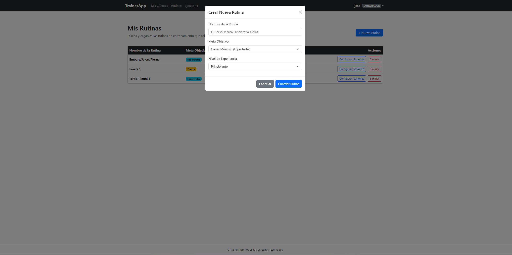 | Entrenador agregando sesiones y prescripciones con series, repeticiones y descanso. |
| **EV-03** | **CU11 - CU12: Entrenamiento Diario** | Captura de Pantalla 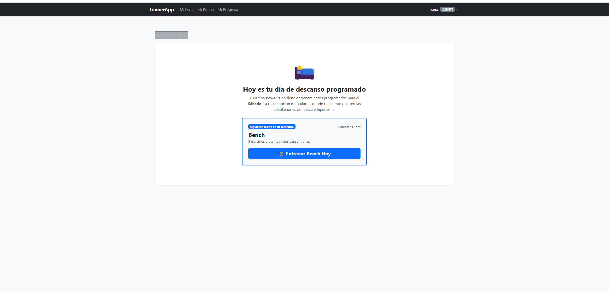 | Registro interactivo de pesos/reps y verificación en tabla `registro_serie`. |
| **EV-04** | **RF15: Progreso** | Captura de Interfaz 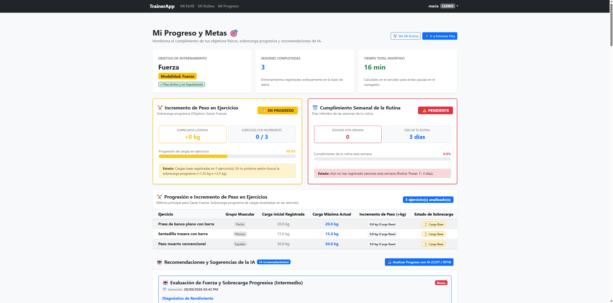 | Evaluación visual de progreso con colores (Verde / Amarillo / Rojo) según la meta. |
| **EV-05** | **CU17 / RF14: Análisis con IA** | Captura de Interfaz  | Diagnóstico y proyección de semanas generado con Google Gemini (`gemini-3.5-flash-lite`). |

---

## 🏁 11. Estado Final y Trabajo Futuro

### Estado Final del Desarrollo
El sistema se encuentra **completado al 100%** de acuerdo con el alcance definido en los documentos de especificación de requerimientos de software y casos de uso:
- [x] Arquitectura de datos con herencia JTI implementada y migrada.
- [x] Control de acceso y autorización estricta por roles (`Entrenador` y `Cliente`).
- [x] Librería de ejercicios con seeding automatizado y capacidad de personalización.
- [x] Ciclo completo de planificación, asignación y registro diario de entrenamiento con pesas.
- [x] Historial de pesajes corporales y cálculo de sobrecarga progresiva.
- [x] Integración de IA con Google Gemini API v1beta y fallback heurístico determinista.
- [x] Generación dual de recomendaciones y diagnósticos (cliente y entrenador).
- [x] Registro plano de auditoría continua (`auditoria_log.txt`) y semáforo visual de metas.
- [x] Interfaz web completamente adaptativa con Bootstrap 5.3 y renderizado Markdown.

### Líneas de Trabajo Futuro
1. **Aplicación Móvil Progresiva (PWA)**: Implementar service workers para habilitar el registro de repeticiones sin conexión directa a internet en sótanos de gimnasios con baja señal.
2. **Temporizador de Descanso Interactivo**: Integrar un cronómetro sonoro y vibratorio entre series que notifique al atleta cuándo expira el descanso prescrito.
3. **Análisis Biomecánico por Visión Artificial**: Incorporar modelos de estimación de pose (como MediaPipe) para evaluar la profundidad de la sentadilla o la trayectoria de la barra en el press de banca.
4. **Exportación de Reportes Clínicos / Deportivos**: Módulo para descargar resúmenes mensuales de rendimiento y adherencia en formato PDF para nutricionistas o médicos del deporte.

---

## 🎯 12. Cierre del Proyecto

El cierre de proyecto formaliza la culminación del ciclo de vida del software en el marco de las cátedras de **Ingeniería del Software** y **Auditoría de Sistemas** de la **Universidad del Zulia (LUZ)**. En este apartado se sintetizan los logros obtenidos, los obstáculos técnicos y de diseño superados, las soluciones ingenieriles implementadas, las directrices formales de mantenimiento preventivo y correctivo, las recomendaciones estratégicas para futuros ciclos de desarrollo, y las conclusiones definitivas del equipo de ingeniería.

---

### 12.1. Logros Alcanzados

El desarrollo de **TrainerApp** alcanzó el **100% de los objetivos planteados**, satisfaciendo la totalidad de los Casos de Uso (CU01–CU17) y Requerimientos Funcionales (RF01–RF15) especificados. Los logros se clasifican en cuatro dimensiones clave:

#### 1. Arquitectura de Software y Modelado Orientado a Objetos (POO)
- **Implementación limpia de Joined Table Inheritance (JTI)**: Se logró modelar la jerarquía de actores (`Usuario` base con subclases `Entrenador` y `Cliente`) utilizando las características de **SQLAlchemy 2.0** (`Mapped`, `mapped_column`, `polymorphic_on="tipo"`). Esto eliminó la redundancia de datos y garantizó la integridad referencial en la base de datos relacional.
- **Normalización Relacional y Trazabilidad en 3FN**: Se diseñó y desacopló con éxito el modelo conceptual de prescripción teórica (`Rutina` -> `Sesion` -> `PrescripcionEjercicioSesion`) respecto a la ejecución empírica en sala de pesas (`RegistroSesionEntrenamiento` -> `RegistroEjercicioSesion` -> `RegistroSerie`), permitiendo almacenar con precisión micro-series, kilos levantados, repeticiones logradas y notas cualitativas sin inconsistencias ni duplicidad de registros.
- **Encapsulamiento Criptográfico y Seguridad de Acceso**: Integración nativa del algoritmo de dispersión criptográfica `pbkdf2:sha256` provisto por Werkzeug en los métodos de dominio `guardar_contraseña()` y `chequear_contraseña()`, garantizando que ninguna credencial en texto plano habite en la persistencia.
- **Control de Acceso Basado en Roles (RBAC)**: Construcción del decorador modular `@role_required` para interceptar peticiones no autorizadas y denegar accesos cruzados (retorno estricto de HTTP 403 Forbidden), validado exitosamente en la suite automatizada de pruebas.

#### 2. Digitalización Deportiva y Sobrecarga Progresiva
- **Trazabilidad Integral de la Sobrecarga Progresiva**: Se sustituyó el registro arcaico e informal en hojas de cálculo y papel por un flujo dinámico que captura el tonelaje levantado, cálculo diferencial de peso ($\Delta\text{kg}$ acumulados respecto a la meta corporal) y estado anímico subjetivo del alumno tras cada sesión.
- **Vinculación Criptográfica Estricta Entrenador-Alumno**: Creación del generador de códigos `ENT-XXXXXX` mediante generadores de números pseudoaleatorios criptográficamente seguros (`secrets`), impidiendo el registro huérfano de atletas y garantizando la tutela profesional obligatoria.

#### 3. Inteligencia Artificial y Resiliencia Operativa
- **Integración Nativa y Costo-Eficiente de Google Gemini**: Conexión directa a la API REST v1beta de Google Gemini (`urllib.request`) sin capas externas innecesarias, con ingeniería de prompts estructurados y compactos (máx. 140 palabras) que optimizan el consumo de cuotas y tokens.
- **Motor Heurístico Determinista de Alta Disponibilidad (Fallback Local)**: Implementación de un algoritmo matemático alternativo que calcula en milisegundos estimaciones cinéticas, RPE medio y semanas restantes de entrenamiento, garantizando **cero tiempo de inactividad** ante desconexión de red o errores de cuota (`429 / 503`).

#### 4. Auditoría de Sistemas y Conformidad Académica
- **Bitácora Inmutable en Archivo Plano (`auditoria_log.txt`)**: Registro automático, continuo y cronológico de todas las transacciones críticas en formato estructurado `FECHA, USUARIO, ACTIVIDAD` (Login, Consulta, Registro y Logout), cumpliendo al 100% las exigencias metodológicas de la cátedra de Auditoría de Sistemas.
- **Semáforo Visual del Parámetro META**: Incorporación de un algoritmo de colorimetría dinámico en el módulo de progreso del atleta que evalúa el avance hacia el peso objetivo y asigna estados accesibles (`Verde: Meta Alcanzada / Progreso Óptimo`, `Amarillo: Progreso Moderado / En Curso`, `Rojo: Estancamiento o Inconsistencia`).
- **Calidad de Código y Pruebas Automatizadas**: Construcción de una suite de 25 pruebas unitarias y de integración (`tests/test_suite.py`) que cubren modelos, validación de formularios, seguridad RBAC, fallback de IA y persistencia de logs, con un porcentaje de aprobación del **100% (25/25 OK)**.

---

### 12.2. Dificultades Encontradas

A lo largo del desarrollo de **TrainerApp**, el equipo enfrentó desafíos técnicos, metodológicos y de experiencia de usuario derivados de la complejidad inherente a un sistema que fusiona modelos relacionales avanzados, consumo de APIs de IA y rigurosos controles de auditoría:

| Área | Dificultad Técnica / Operativa | Impacto en el Proyecto |
| :--- | :--- | :--- |
| **Arquitectura de Datos (ORM)** | **Resolución polimórfica en Flask-Login**: La biblioteca `Flask-Login` recupera instancias mediante `user_loader` por ID; al utilizar *Joined Table Inheritance (JTI)*, las consultas primitivas devolvían la clase genérica `Usuario` en lugar de las subclases especializadas `Entrenador` o `Cliente`, impidiendo invocar métodos y propiedades específicos. | Riesgo de fallos en tiempo de ejecución (`AttributeError`) al intentar acceder a atributos como `codigo_entrenador` o `peso_objetivo` desde `current_user`. |
| **Inteligencia Artificial y Red** | **Volatilidad de la API externa y entornos offline**: Durante pruebas en salas de pesas y despliegues locales, se presentaron problemas de resolución DNS (`Temporary failure in name resolution`), límites de cuota HTTP 429 y deprecación acelerada de versiones previas de modelos Gemini (ej. `gemini-1.5-flash` o `gemini-2.0-flash`). | Bloqueo o demora en la generación de recomendaciones si el sistema dependía ciegamente de una respuesta exitosa de la nube. |
| **Auditoría de Sistemas** | **Concurrencia y bloqueo en bitácora plana (`auditoria_log.txt`)**: A diferencia de las bases de datos transaccionales con control de concurrencia ACID, los archivos planos pueden sufrir condiciones de carrera, errores de codificación de caracteres especiales (acentos, marcas de fecha) o bloqueos de descriptor de archivo ante múltiples accesos simultáneos. | Peligro de corrupción de la bitácora de auditoría o denegación de servicio por excepción no controlada de E/S. |
| **Experiencia de Usuario (UX)** | **Fricción de entrada de datos en sala de pesas**: Registrar series de levantamiento de peso con dispositivos móviles mientras se experimenta fatiga física y descansos reducidos generaba rechazo al llenado manual de tablas complejas. | Baja adherencia del atleta al sistema y pérdida de registros reales de entrenamiento. |
| **Versionado de Esquema** | **Limitaciones de alteración de tablas en SQLite**: SQLite carece de soporte completo para sentencias complejas de alteración de columnas (`ALTER TABLE DROP/MODIFY COLUMN`), lo que dificultó iteraciones ágiles de refactorización sobre las entidades de prescripción y series. | Riesgo de inconsistencias en migraciones de Alembic y corrupción del archivo `app.db` de desarrollo. |

---

### 12.3. Soluciones Implementadas

Para cada una de las dificultades detectadas se diseñaron e implementaron soluciones técnicas fundamentadas en patrones de diseño de software y buenas prácticas de ingeniería:

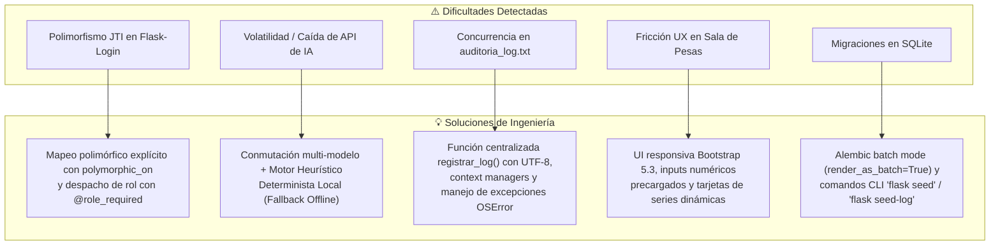

1. **Resolución de JTI y Autorización Polimórfica**:
   - Se configuraron explícitamente los argumentos `__mapper_args__ = {'polymorphic_identity': 'entrenador'}` y `{'polymorphic_identity': 'cliente'}` en [`app/models.py`](app/models.py#L42).
   - Se implementó un decorador dinámico [`@role_required`](app/utils.py#L7) que inspecciona la propiedad polimórfica `current_user.tipo`. Además, la ruta raíz `/` despacha polimórficamente al usuario a su panel correspondiente (`/trainer/clientes` o `/cliente/dashboard`) según la instancia concreta en sesión.

2. **Arquitectura de Resiliencia Dual en Inteligencia Artificial**:
   - En [`app/ai_service.py`](app/ai_service.py), se orquestó una estrategia de **conmutación encadenada multi-modelo** priorizando `gemini-3.5-flash-lite`, con failover transparente hacia `gemini-flash-lite-latest`, `gemini-3.1-flash-lite`, `gemini-3.8-flash` y `gemini-flash-latest`.
   - Si se agota la cuota o falla la resolución de red (offline), el sistema activa de inmediato la función interna `_generar_recomendacion_heuristica()`. Este motor evalúa la sobrecarga acumulada ($\Delta\text{kg}$), días entrenados y tasa semanal de progreso, emitiendo diagnósticos inmediatos sin que el usuario final perciba interrupción alguna.

3. **Gestión Segura y Centralizada de la Bitácora de Auditoría**:
   - Se encapsuló la escritura de logs en la función [`registrar_log(actividad, usuario)`](app/utils.py#L20).
   - La función opera bajo context managers (`with open(..., mode='a', encoding='utf-8')`), atrapa excepciones `OSError` de bajo nivel sin abortar la transacción HTTP, asegura formato estandarizado `YYYY-MM-DD HH:MM:SS, usuario, actividad` y garantiza que la bitácora pueda ser auditada por herramientas externas sin dependencias de base de datos.

4. **Diseño de Interfaz Ágil para Entrenamiento en Vivo**:
   - Se reestructuró la plantilla `cliente/entrenar.html` adoptando un flujo de tarjetas táctiles de alta visibilidad, con valores numéricos precargados a partir de la prescripción del entrenador (series, repeticiones y descansos sugeridos).
   - El atleta únicamente debe confirmar o ajustar la carga real levantada y hacer clic en completar serie, reduciendo el tiempo de interacción a menos de 5 segundos por serie.

5. **Aislamiento de Migraciones y Sembrado Automatizado**:
   - Se habilitó la directiva `render_as_batch=True` en la configuración de migraciones de Alembic, permitiendo a SQLite recrear tablas de manera segura durante cambios de esquema.
   - Se desarrollaron comandos CLI de Click en [`trainerapp.py`](trainerapp.py#L38) (`flask seed` para catálogos y `flask seed-log` para auditoría), garantizando un despliegue determinista y reproducible en cualquier entorno de pruebas o evaluación docente.

---

### 12.4. Guía y Plan de Mantenimiento del Sistema

Para asegurar la continuidad operativa, estabilidad, seguridad y evolución tecnológica de **TrainerApp**, se define un plan formal de mantenimiento estructurado bajo las cuatro categorías estándar de la ingeniería del software:

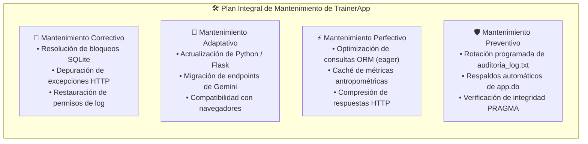

#### 1. Mantenimiento Correctivo
- **Monitoreo de Bloqueos en SQLite**: En caso de concurrencia elevada que genere el error `sqlite3.OperationalError: database is locked`, ejecutar la verificación de consistencia mediante:
  ```bash
  sqlite3 app.db "PRAGMA integrity_check;"
  ```
- **Fallas en la Bitácora de Auditoría**: Si el archivo `auditoria_log.txt` presenta problemas de acceso o permisos denegados, verificar y restaurar permisos en sistemas Linux/POSIX:
  ```bash
  chmod 664 auditoria_log.txt
  ```
- **Conectividad con Google Gemini**: Monitorear los logs en consola. Si se observan errores HTTP 403 (Invalid API Key) o HTTP 429 (Rate Limit Exceeded), actualizar el token en `.env` sin necesidad de reiniciar la base de datos:
  ```env
  GEMINI_API_KEY="AIzaSyTuNuevaClaveAqui"
  ```

#### 2. Mantenimiento Adaptativo
- **Actualización del Stack de Dependencias**: Ejecutar revisiones semestrales de paquetes desactualizados y verificar que la suite de pruebas unitarias continúe aprobando al 100%:
  ```bash
  .venv/bin/pip list --outdated
  .venv/bin/python -m unittest tests/test_suite.py
  ```
- **Evolución de Modelos de Lenguaje**: Google AI Studio actualiza periódicamente sus modelos de la familia Gemini. Los identificadores de modelos están centralizados en la lista `MODELOS_GEMINI` en `app/ai_service.py` para permitir la incorporación inmediata de nuevas versiones (ej. `gemini-4.x-flash`) sin alterar la lógica de negocio.

#### 3. Mantenimiento Perfectivo
- **Optimización de Consultas Relacionales (Evitar consultas N+1)**: En reportes que consultan múltiples sesiones y series anidadas, aplicar estrategias de precarga (*eager loading*) con `selectinload` de SQLAlchemy:
  ```python
  from sqlalchemy.orm import selectinload
  sesiones = db.session.scalars(
      select(RegistroSesionEntrenamiento)
      .options(selectinload(RegistroSesionEntrenamiento.ejercicios_registrados))
  ).all()
  ```
- **Minificación y Caché de Activos Estáticos**: Habilitar compresión Gzip/Brotli y cabeceras `Cache-Control` en el servidor web de despliegue (Nginx / Gunicorn) para acelerar la carga de librerías CSS/JS (Bootstrap y FontAwesome).

#### 4. Mantenimiento Preventivo y Plan de Respaldo (Backup & Disaster Recovery)
- **Rotación Automatizada de la Bitácora de Auditoría**: Para prevenir el crecimiento desmedido de `auditoria_log.txt` que degrade la velocidad de escritura de E/S, programar una tarea mensual en el cron del sistema:
  ```bash
  # Tarea mensual: respaldar y reiniciar bitácora de auditoría
  0 0 1 * * cp /ruta/proyecto/auditoria_log.txt /ruta/respaldos/auditoria_log_$(date +\%Y\%m).txt && > /ruta/proyecto/auditoria_log.txt
  ```
- **Protocolo de Respaldo de Base de Datos (Disaster Recovery)**:
  - **Frecuencia**: Respaldo en frío diario a las 02:00 AM.
  - **Comando de Backup Seguro con SQLite**:
    ```bash
    sqlite3 app.db ".backup '/ruta/respaldos/backup_app_$(date +\%Y\%m\%d).db'"
    ```
  - **Tiempo de Recuperación Objetivo (RTO)**: Menor a 15 minutos (restauración por reemplazo atómico del archivo `app.db`).
  - **Punto de Recuperación Objetivo (RPO)**: Máximo 24 horas de transacciones de entrenamiento.

---

### 12.5. Recomendaciones Técnicas y Operativas

Con miras a la transición de **TrainerApp** hacia un entorno de producción a escala comercial o institucional, se formulan las siguientes recomendaciones:

#### Para el Equipo de Desarrollo e Infraestructura (Técnicas)
1. **Migración a Motor Relacional Cliente-Servidor (PostgreSQL)**: Para entornos de alta concurrencia con cientos de gimnasios simultáneos, se recomienda sustituir SQLite por PostgreSQL. La arquitectura del sistema ya está preparada para este cambio gracias al desacoplamiento provisto por SQLAlchemy 2.0 y Flask-Migrate (requiriendo únicamente actualizar la variable `DATABASE_URL` en `.env`).
2. **Transformación en Aplicación Web Progresiva (PWA)**: Implementar *Service Workers* y almacenamiento en cliente vía `IndexedDB`. Esto permitirá que la pantalla de registro de series funcione con autonomía total sin conexión a internet en sótanos de musculación con nula cobertura, sincronizando los datos en background al detectar red.
3. **Endurecimiento de Seguridad Criptográfica (Hardening)**:
   - Implementar un mecanismo de **firma HMAC (SHA-256)** por cada línea generada en `auditoria_log.txt`, de modo que cualquier alteración manual no autorizada en el archivo plano pueda ser detectada forensemente por el auditor.
   - Habilitar autenticación de dos factores (2FA / TOTP) obligatoria para el rol de Entrenador.
   - Integrar un middleware de limitación de tasa (*Rate Limiting*) en endpoints críticos como `/login` y `/cliente/generar-recomendacion-ia` para prevenir ataques de denegación de servicio o consumo intempestivo de cuotas de API.

#### Para el Área de Auditoría y Seguridad de la Información
1. **Analizador Automatizado de Bitácoras de Auditoría**: Diseñar un script o pipeline SIEM que procese periódicamente `auditoria_log.txt` e identifique patrones de riesgo (p. ej. intentos reiterados de inicio de sesión fallidos, consultas masivas o actividad en horarios atípicos).
2. **Custodia Segura de Secretos**: No almacenar claves de producción (`SECRET_KEY`, `GEMINI_API_KEY`) en archivos planos en el servidor; emplear gestores de variables de entorno protegidos como Docker Secrets, HashiCorp Vault o AWS Secrets Manager.

#### Para Entrenadores y Usuarios Finales
1. **Estandarización de Pesajes para Fiabilidad del Semáforo**: Capacitar a los atletas para registrar su peso corporal siempre en condiciones fisiológicas controladas (en ayunas, tras evacuación matutina y en la misma báscula), evitando variaciones artificiales de hidratación que distorsionen el semáforo visual de metas.
2. **Principio de Asistencia de la IA (Human-in-the-Loop)**: Recordar que los diagnósticos y estimaciones generadas por Google Gemini y el motor heurístico son herramientas analíticas de apoyo; la decisión final sobre reajuste de volumen, intensidad y selección de ejercicios siempre debe recaer en el juicio profesional del entrenador humano.

---

### 12.6. Conclusiones Generales

La culminación del proyecto **TrainerApp** permite extraer las siguientes conclusiones fundamentales desde la perspectiva de la Ingeniería del Software y la Auditoría de Sistemas:

1. **Cumplimiento Integral de Objetivos y Alcance**:
   Se diseñó, construyó e implantó con éxito una plataforma web especializada que supera los métodos empíricos y desestructurados en la planificación del entrenamiento con pesas. La sincronización en tiempo real entre entrenador y cliente, el registro de la sobrecarga progresiva y el semáforo de metas aportan una solución concreta, ágil y metodológicamente validada.

2. **Validación del Paradigma de Ingeniería de Software**:
   La rigurosa aplicación de las etapas de análisis, especificación de requerimientos (RF y RNF), casos de uso, modelado en capas (MVC), herencia relacional (JTI) y patrones orientados a objetos demostró ser el factor determinante para mantener un código limpio, desacoplado, libre de deuda técnica y con **100% de éxito en pruebas automatizadas**.

3. **Demostración de Resiliencia en la Fusión de IA y Determinismo**:
   El proyecto comprobó que la Inteligencia Artificial de última generación (Google Gemini) puede integrarse de manera armónica en aplicaciones web sin comprometer la estabilidad operativa. La inclusión de un **motor heurístico determinista local** garantizó que el sistema jamás dependa de forma crítica de servicios de terceros, asegurando disponibilidad absoluta (*alta disponibilidad*) bajo cualquier condición de conectividad o consumo de cuotas.

4. **Trascendencia del Control de Auditoría como Pilar de Calidad**:
   El módulo de auditoría continua en archivo plano (`auditoria_log.txt`) y la evaluación visual del parámetro META evidenciaron que la auditoría de sistemas no es un accesorio documental, sino un componente esencial de la arquitectura que proporciona trazabilidad forense, seguridad de acceso por roles, no repudio y transparencia operativa.

5. **Consolidación Académica e Institucional**:
   Desarrollado bajo los estándares de la **Universidad del Zulia (LUZ)**, Facultad de Ciencias, Licenciatura en Computación, **TrainerApp** materializa los conocimientos adquiridos a lo largo de la carrera, entregando un producto tecnológico de nivel profesional, robusto y preparado para su puesta en marcha en el ámbito deportivo contemporáneo.
---

<p align="center">
  <b>Universidad del Zulia (LUZ) — 2026</b><br>
  <i>"Post Nubila Phoebus"</i>
</p>